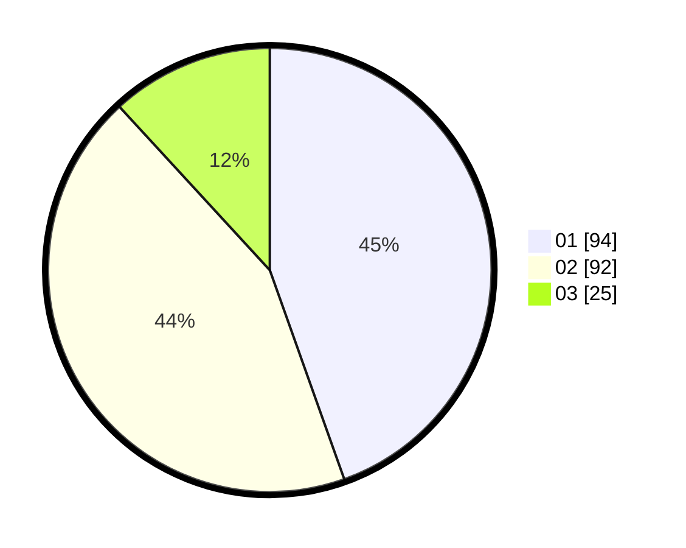

# Hasil

Hasil perolehan suara paslon dapat dilihat pada file paslon-01.txt, paslon-02.txt, dan paslon-03.txt.

Jika tidak ada, artinya data tersebut belum ada pada SIREKAP.

## Perolehan Suara

 * Paslon 01: **94**.
 * Paslon 02: **92**.
 * Paslon 03: **25**.

## Foto C Plano

https://sirekap-obj-formc.kpu.go.id/a015/pemilu/ppwp/31/75/03/10/08/3175031008029-20240214-214047--0cc6a78d-6776-40fa-bcae-1751b135ca88.jpg

https://sirekap-obj-formc.kpu.go.id/a015/pemilu/ppwp/31/75/03/10/08/3175031008029-20240214-221355--305a76e8-d73b-44bd-b202-ee468fd623db.jpg

https://sirekap-obj-formc.kpu.go.id/a015/pemilu/ppwp/31/75/03/10/08/3175031008029-20240214-211504--83abcc65-b39b-4841-80af-8d1180ee1b74.jpg
