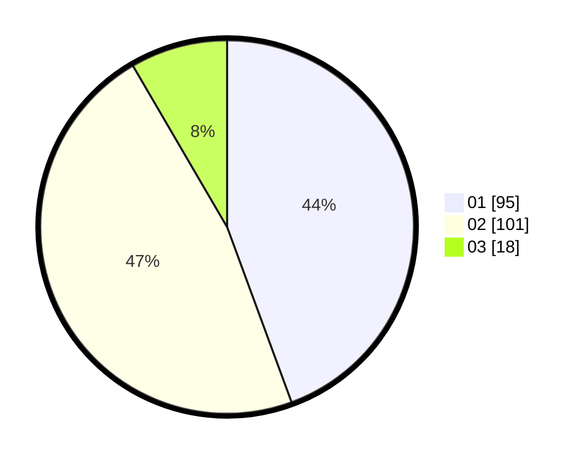

# Hasil

Hasil perolehan suara paslon dapat dilihat pada file paslon-01.txt, paslon-02.txt, dan paslon-03.txt.

Jika tidak ada, artinya data tersebut belum ada pada SIREKAP.

## Perolehan Suara

 * Paslon 01: **95**.
 * Paslon 02: **101**.
 * Paslon 03: **18**.

## Foto C Plano

https://sirekap-obj-formc.kpu.go.id/baba/pemilu/ppwp/31/75/03/10/08/3175031008031-20240214-155015--edbb3e89-dd49-41e9-8ca8-5b8629753c54.jpg

https://sirekap-obj-formc.kpu.go.id/baba/pemilu/ppwp/31/75/03/10/08/3175031008031-20240214-155259--2ff561b8-6ba7-4216-b6d8-890aa409c00e.jpg

https://sirekap-obj-formc.kpu.go.id/baba/pemilu/ppwp/31/75/03/10/08/3175031008031-20240214-155550--f08da844-c23c-45a1-a243-499277043852.jpg

## DATA PEMILIH TETAP

Jumlah pemilih dalam DPT: **275**.
 * L: **141**.
 * P: **134**.

## DATA PENGGUNA HAK PILIH

Jumlah pengguna hak pilih dalam DPT: **219**.
 * L: **111**.
 * P: **108**.

Jumlah pengguna hak pilih dalam DPTb: **0**.
 * L: **0**.
 * P: **0**.

Jumlah pengguna hak pilih dalam DPK: **0**.
 * L: **0**.
 * P: **0**.

Jumlah pengguna hak pilih: **219**.
 * L: **111**.
 * P: **108**.

## JUMLAH SUARA SAH DAN TIDAK SAH

JUMLAH SELURUH SUARA SAH: **214**.

JUMLAH SUARA TIDAK SAH: **5**.

JUMLAH SELURUH SUARA SAH DAN SUARA TIDAK SAH: **219**.
