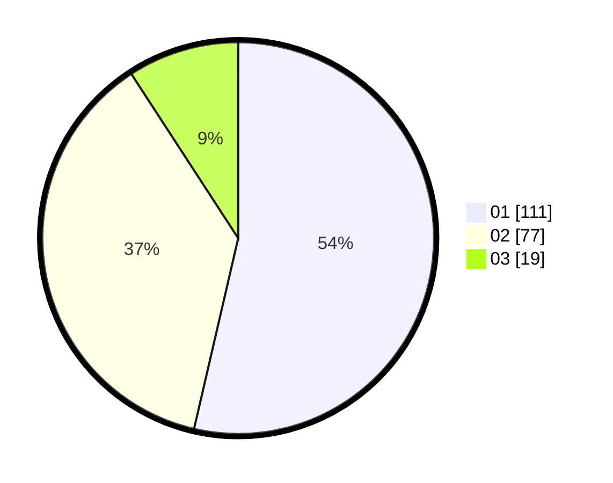

# Hasil

Hasil perolehan suara paslon dapat dilihat pada file paslon-01.txt, paslon-02.txt, dan paslon-03.txt.

Jika tidak ada, artinya data tersebut belum ada pada SIREKAP.

## Perolehan Suara

 * Paslon 01: **111**.
 * Paslon 02: **77**.
 * Paslon 03: **19**.

## Foto C Plano

https://sirekap-obj-formc.kpu.go.id/88d3/pemilu/ppwp/31/75/03/10/08/3175031008037-20240218-211756--dac7c96b-6e3b-4e1f-b41c-555ceaa35107.jpg

https://sirekap-obj-formc.kpu.go.id/88d3/pemilu/ppwp/31/75/03/10/08/3175031008037-20240218-211758--9b6d6fd1-7d5a-43a9-81fc-45d79e070c59.jpg

https://sirekap-obj-formc.kpu.go.id/88d3/pemilu/ppwp/31/75/03/10/08/3175031008037-20240218-211757--33d9b98d-ec54-4caf-adec-d9584937fc41.jpg

## DATA PEMILIH TETAP

Jumlah pemilih dalam DPT: **270**.
 * L: **133**.
 * P: **137**.

## DATA PENGGUNA HAK PILIH

Jumlah pengguna hak pilih dalam DPT: **208**.
 * L: **101**.
 * P: **107**.

Jumlah pengguna hak pilih dalam DPTb: **0**.
 * L: **0**.
 * P: **0**.

Jumlah pengguna hak pilih dalam DPK: **0**.
 * L: **0**.
 * P: **0**.

Jumlah pengguna hak pilih: **208**.
 * L: **101**.
 * P: **107**.

## JUMLAH SUARA SAH DAN TIDAK SAH

JUMLAH SELURUH SUARA SAH: **207**.

JUMLAH SUARA TIDAK SAH: **1**.

JUMLAH SELURUH SUARA SAH DAN SUARA TIDAK SAH: **208**.
