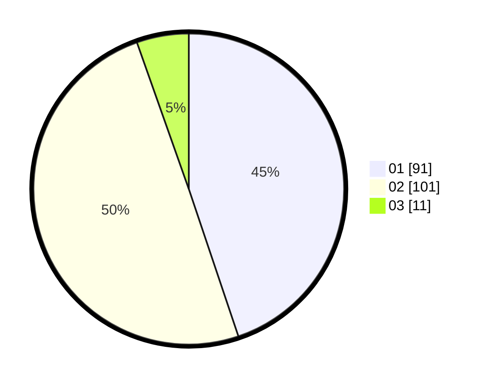

# Hasil

Hasil perolehan suara paslon dapat dilihat pada file paslon-01.txt, paslon-02.txt, dan paslon-03.txt.

Jika tidak ada, artinya data tersebut belum ada pada SIREKAP.

## Perolehan Suara

 * Paslon 01: **91**.
 * Paslon 02: **101**.
 * Paslon 03: **11**.

## Foto C Plano

https://sirekap-obj-formc.kpu.go.id/612d/pemilu/ppwp/31/75/03/10/08/3175031008041-20240215-042201--7dadce5b-8948-4521-8d60-1595e01c5b6d.jpg

https://sirekap-obj-formc.kpu.go.id/612d/pemilu/ppwp/31/75/03/10/08/3175031008041-20240215-042222--1afa6133-7279-4d3e-bffa-6d7a4b371172.jpg

https://sirekap-obj-formc.kpu.go.id/612d/pemilu/ppwp/31/75/03/10/08/3175031008041-20240215-042211--86372a99-3169-40ef-96ff-92a1af76280d.jpg

## DATA PEMILIH TETAP

Jumlah pemilih dalam DPT: **272**.
 * L: **149**.
 * P: **123**.

## DATA PENGGUNA HAK PILIH

Jumlah pengguna hak pilih dalam DPT: **203**.
 * L: **104**.
 * P: **99**.

Jumlah pengguna hak pilih dalam DPTb: **0**.
 * L: **0**.
 * P: **0**.

Jumlah pengguna hak pilih dalam DPK: **0**.
 * L: **0**.
 * P: **0**.

Jumlah pengguna hak pilih: **203**.
 * L: **104**.
 * P: **99**.

## JUMLAH SUARA SAH DAN TIDAK SAH

JUMLAH SELURUH SUARA SAH: **203**.

JUMLAH SUARA TIDAK SAH: **0**.

JUMLAH SELURUH SUARA SAH DAN SUARA TIDAK SAH: **203**.
