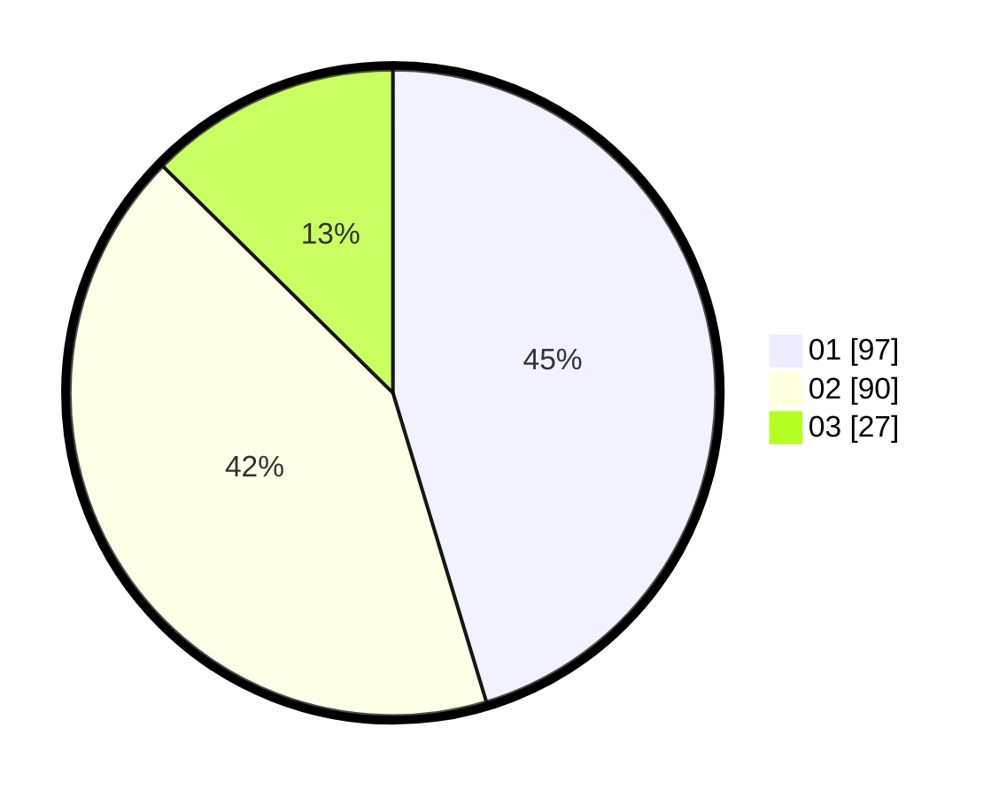

# Hasil

Hasil perolehan suara paslon dapat dilihat pada file paslon-01.txt, paslon-02.txt, dan paslon-03.txt.

Jika tidak ada, artinya data tersebut belum ada pada SIREKAP.

## Perolehan Suara

 * Paslon 01: **97**.
 * Paslon 02: **90**.
 * Paslon 03: **27**.

## Foto C Plano

https://sirekap-obj-formc.kpu.go.id/2d36/pemilu/ppwp/31/75/03/10/08/3175031008042-20240216-131927--3ff283e8-ca58-494a-b222-9850e9e7605a.jpg

https://sirekap-obj-formc.kpu.go.id/2d36/pemilu/ppwp/31/75/03/10/08/3175031008042-20240216-131930--674dc88d-03c6-4826-8d54-a69cc0a4bc24.jpg

https://sirekap-obj-formc.kpu.go.id/2d36/pemilu/ppwp/31/75/03/10/08/3175031008042-20240216-131928--815cf7b6-ed0b-4122-8e2e-3a93a67798b1.jpg

## DATA PEMILIH TETAP

Jumlah pemilih dalam DPT: **0**.
 * L: **0**.
 * P: **0**.

## DATA PENGGUNA HAK PILIH

Jumlah pengguna hak pilih dalam DPT: **0**.
 * L: **0**.
 * P: **0**.

Jumlah pengguna hak pilih dalam DPTb: **0**.
 * L: **0**.
 * P: **0**.

Jumlah pengguna hak pilih dalam DPK: **0**.
 * L: **0**.
 * P: **0**.

Jumlah pengguna hak pilih: **0**.
 * L: **0**.
 * P: **0**.

## JUMLAH SUARA SAH DAN TIDAK SAH

JUMLAH SELURUH SUARA SAH: **214**.

JUMLAH SUARA TIDAK SAH: **6**.

JUMLAH SELURUH SUARA SAH DAN SUARA TIDAK SAH: **220**.
