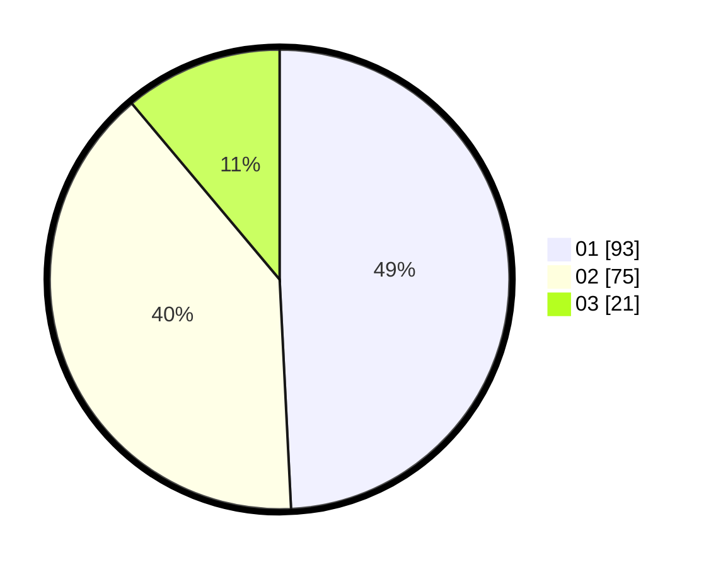

# Hasil

Hasil perolehan suara paslon dapat dilihat pada file paslon-01.txt, paslon-02.txt, dan paslon-03.txt.

Jika tidak ada, artinya data tersebut belum ada pada SIREKAP.

## Perolehan Suara

 * Paslon 01: **93**.
 * Paslon 02: **75**.
 * Paslon 03: **21**.

## Foto C Plano

https://sirekap-obj-formc.kpu.go.id/3345/pemilu/ppwp/31/75/03/10/08/3175031008048-20240216-044157--1e42699b-feb8-4fa5-9d31-9c5f7cdef94c.jpg

https://sirekap-obj-formc.kpu.go.id/3345/pemilu/ppwp/31/75/03/10/08/3175031008048-20240216-044158--737dc8bb-0a1d-405b-9abb-31bc020a809f.jpg

https://sirekap-obj-formc.kpu.go.id/3345/pemilu/ppwp/31/75/03/10/08/3175031008048-20240216-044157--91d1a290-4b15-4de2-8dfd-884b747c9022.jpg

## DATA PEMILIH TETAP

Jumlah pemilih dalam DPT: **267**.
 * L: **134**.
 * P: **133**.

## DATA PENGGUNA HAK PILIH

Jumlah pengguna hak pilih dalam DPT: **188**.
 * L: **95**.
 * P: **93**.

Jumlah pengguna hak pilih dalam DPTb: **0**.
 * L: **0**.
 * P: **0**.

Jumlah pengguna hak pilih dalam DPK: **3**.
 * L: **2**.
 * P: **1**.

Jumlah pengguna hak pilih: **191**.
 * L: **97**.
 * P: **94**.

## JUMLAH SUARA SAH DAN TIDAK SAH

JUMLAH SELURUH SUARA SAH: **189**.

JUMLAH SUARA TIDAK SAH: **2**.

JUMLAH SELURUH SUARA SAH DAN SUARA TIDAK SAH: **191**.
