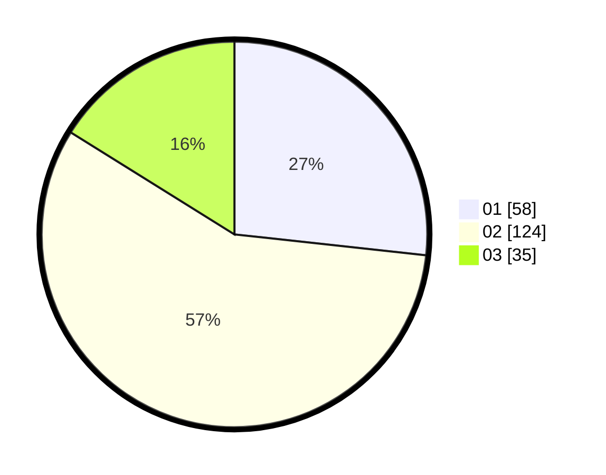

# Hasil

Hasil perolehan suara paslon dapat dilihat pada file paslon-01.txt, paslon-02.txt, dan paslon-03.txt.

Jika tidak ada, artinya data tersebut belum ada pada SIREKAP.

## Perolehan Suara

 * Paslon 01: **58**.
 * Paslon 02: **124**.
 * Paslon 03: **35**.

## Foto C Plano

https://sirekap-obj-formc.kpu.go.id/992f/pemilu/ppwp/31/75/03/10/08/3175031008055-20240214-224730--6c2a25c6-9e1b-4f4a-8e2b-045120fdd134.jpg

https://sirekap-obj-formc.kpu.go.id/992f/pemilu/ppwp/31/75/03/10/08/3175031008055-20240214-221855--0dc18917-7e12-4e5b-82c1-5820c3e4ddf1.jpg

https://sirekap-obj-formc.kpu.go.id/992f/pemilu/ppwp/31/75/03/10/08/3175031008055-20240214-224837--1e9e8a6d-5350-4187-a795-58455f7897f6.jpg
