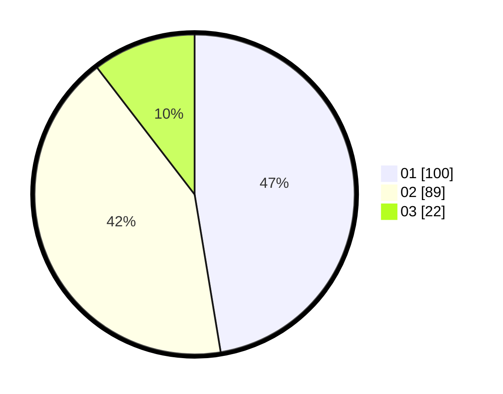

# Hasil

Hasil perolehan suara paslon dapat dilihat pada file paslon-01.txt, paslon-02.txt, dan paslon-03.txt.

Jika tidak ada, artinya data tersebut belum ada pada SIREKAP.

## Perolehan Suara

 * Paslon 01: **100**.
 * Paslon 02: **89**.
 * Paslon 03: **22**.

## Foto C Plano

https://sirekap-obj-formc.kpu.go.id/30dc/pemilu/ppwp/31/75/03/10/08/3175031008058-20240214-223238--c2ffed0d-6812-4c92-a537-250a5cbd5aa7.jpg

https://sirekap-obj-formc.kpu.go.id/30dc/pemilu/ppwp/31/75/03/10/08/3175031008058-20240214-223347--cc65e7ed-dca3-4c7b-9ff6-65b4d0a63529.jpg

https://sirekap-obj-formc.kpu.go.id/30dc/pemilu/ppwp/31/75/03/10/08/3175031008058-20240214-223436--638cb3e0-34fd-41c7-b327-9c76b165f27c.jpg
