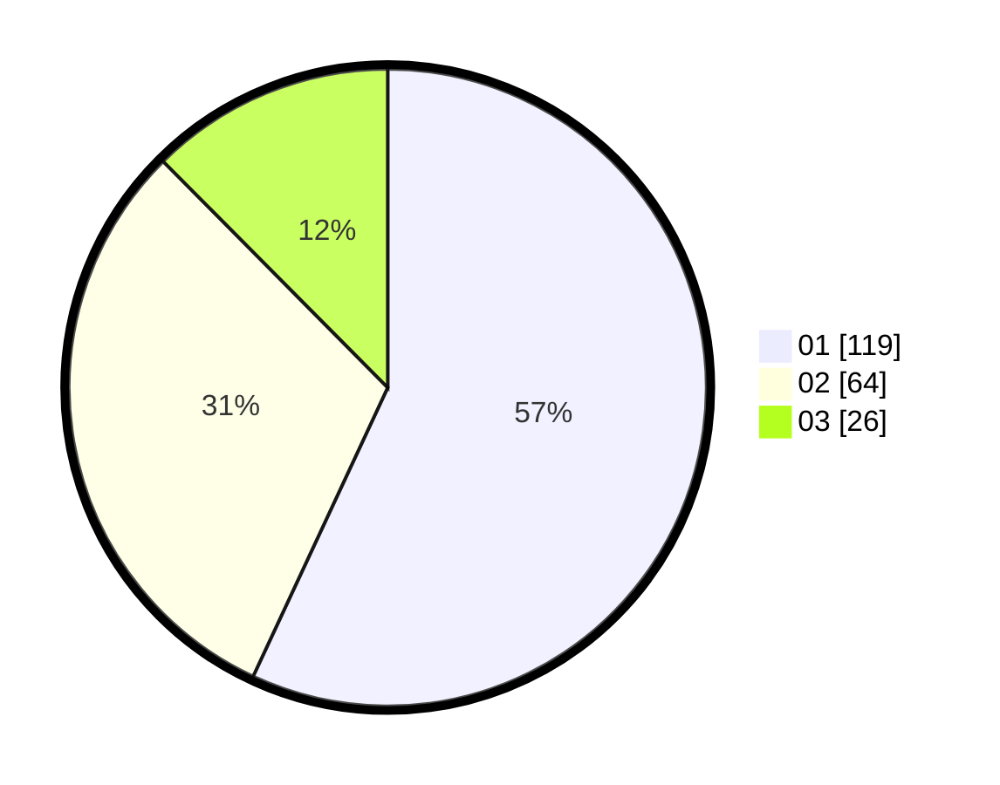

# Hasil

Hasil perolehan suara paslon dapat dilihat pada file paslon-01.txt, paslon-02.txt, dan paslon-03.txt.

Jika tidak ada, artinya data tersebut belum ada pada SIREKAP.

## Perolehan Suara

 * Paslon 01: **119**.
 * Paslon 02: **64**.
 * Paslon 03: **26**.

## Foto C Plano

https://sirekap-obj-formc.kpu.go.id/d912/pemilu/ppwp/31/75/03/10/08/3175031008062-20240215-090814--0fdfae62-e945-4e62-89e0-10fee2d5b050.jpg

https://sirekap-obj-formc.kpu.go.id/d912/pemilu/ppwp/31/75/03/10/08/3175031008062-20240215-090836--9ff8a8c7-de69-4245-a8bb-c7942d033048.jpg

https://sirekap-obj-formc.kpu.go.id/d912/pemilu/ppwp/31/75/03/10/08/3175031008062-20240215-090825--37f022cb-3e3b-4919-af5b-ff686bd9b87c.jpg

## DATA PEMILIH TETAP

Jumlah pemilih dalam DPT: **0**.
 * L: **0**.
 * P: **0**.

## DATA PENGGUNA HAK PILIH

Jumlah pengguna hak pilih dalam DPT: **0**.
 * L: **0**.
 * P: **0**.

Jumlah pengguna hak pilih dalam DPTb: **0**.
 * L: **0**.
 * P: **0**.

Jumlah pengguna hak pilih dalam DPK: **0**.
 * L: **0**.
 * P: **0**.

Jumlah pengguna hak pilih: **0**.
 * L: **0**.
 * P: **0**.

## JUMLAH SUARA SAH DAN TIDAK SAH

JUMLAH SELURUH SUARA SAH: **209**.

JUMLAH SUARA TIDAK SAH: **4**.

JUMLAH SELURUH SUARA SAH DAN SUARA TIDAK SAH: **213**.
