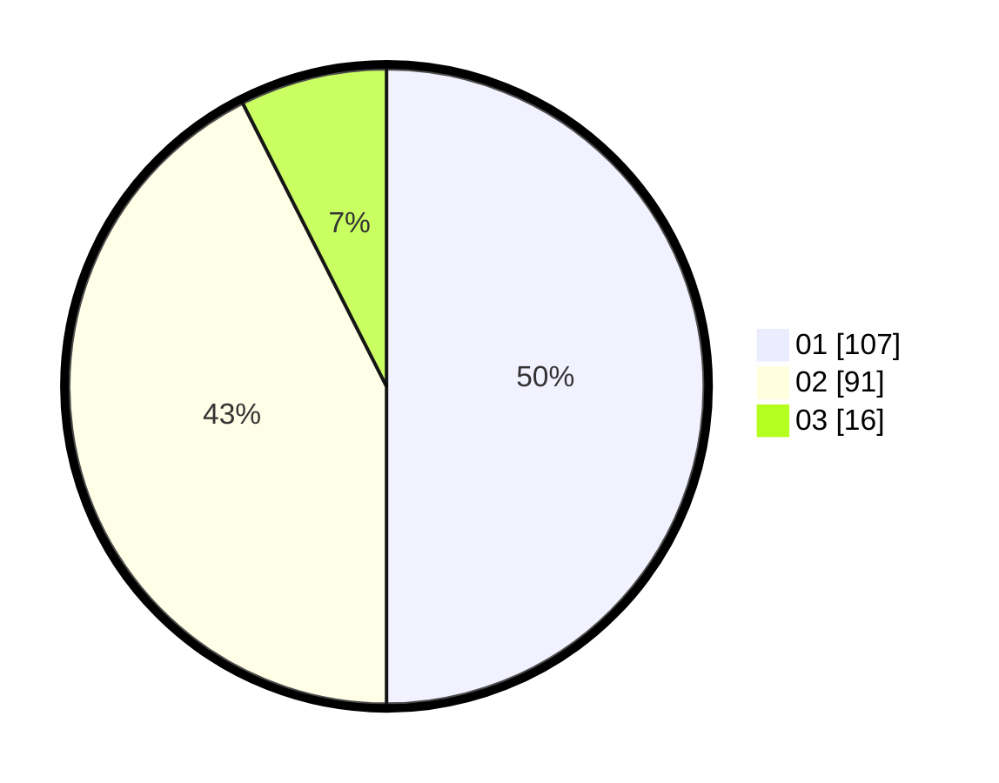

# Hasil

Hasil perolehan suara paslon dapat dilihat pada file paslon-01.txt, paslon-02.txt, dan paslon-03.txt.

Jika tidak ada, artinya data tersebut belum ada pada SIREKAP.

## Perolehan Suara

 * Paslon 01: **107**.
 * Paslon 02: **91**.
 * Paslon 03: **16**.

## Foto C Plano

https://sirekap-obj-formc.kpu.go.id/1738/pemilu/ppwp/31/75/03/10/08/3175031008063-20240215-003159--af35c076-cd97-45d2-bfcc-a2de616f94b0.jpg

https://sirekap-obj-formc.kpu.go.id/1738/pemilu/ppwp/31/75/03/10/08/3175031008063-20240215-003317--d4e6d4d9-62a2-4634-af42-7406ee9d103f.jpg

https://sirekap-obj-formc.kpu.go.id/1738/pemilu/ppwp/31/75/03/10/08/3175031008063-20240215-003518--ed9a25c7-eb22-4ea1-aa39-314f94cbe71c.jpg
