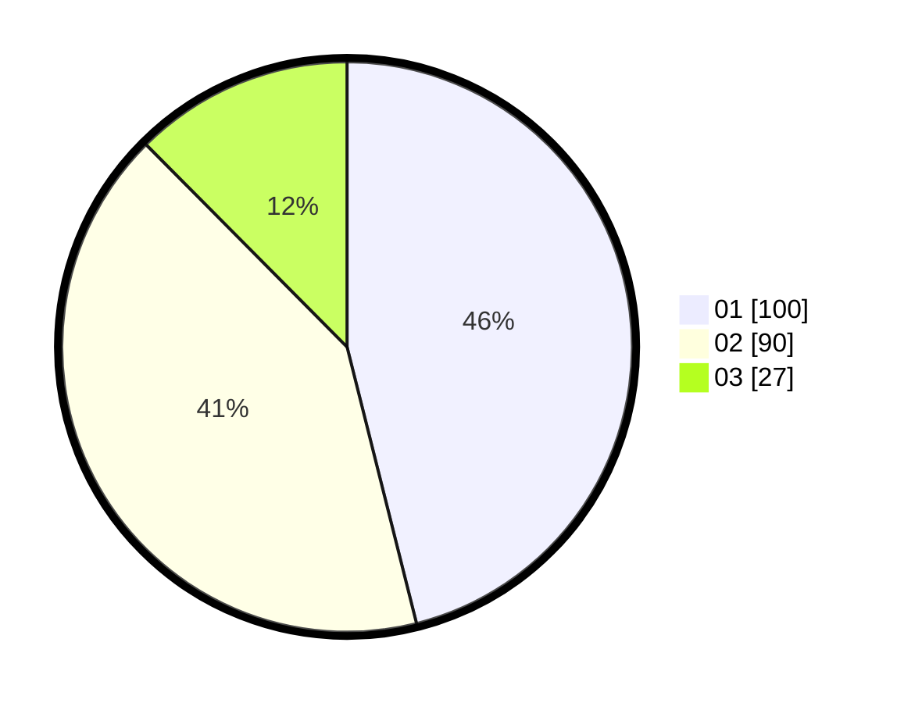

# Hasil

Hasil perolehan suara paslon dapat dilihat pada file paslon-01.txt, paslon-02.txt, dan paslon-03.txt.

Jika tidak ada, artinya data tersebut belum ada pada SIREKAP.

## Perolehan Suara

 * Paslon 01: **100**.
 * Paslon 02: **90**.
 * Paslon 03: **27**.

## Foto C Plano

https://sirekap-obj-formc.kpu.go.id/38d3/pemilu/ppwp/31/75/03/10/08/3175031008065-20240216-132926--f387265c-94ee-4b89-a0d7-5f05dc865dec.jpg

https://sirekap-obj-formc.kpu.go.id/38d3/pemilu/ppwp/31/75/03/10/08/3175031008065-20240216-132927--05713152-55a2-48b2-805d-3ffb52326170.jpg

https://sirekap-obj-formc.kpu.go.id/38d3/pemilu/ppwp/31/75/03/10/08/3175031008065-20240216-132926--9daf75e0-77f0-4ea4-903c-ff83cb9cf186.jpg

## DATA PEMILIH TETAP

Jumlah pemilih dalam DPT: **209**.
 * L: **103**.
 * P: **106**.

## DATA PENGGUNA HAK PILIH

Jumlah pengguna hak pilih dalam DPT: **271**.
 * L: **136**.
 * P: **135**.

Jumlah pengguna hak pilih dalam DPTb: **7**.
 * L: **4**.
 * P: **3**.

Jumlah pengguna hak pilih dalam DPK: **1**.
 * L: **1**.
 * P: **0**.

Jumlah pengguna hak pilih: **279**.
 * L: **141**.
 * P: **138**.

## JUMLAH SUARA SAH DAN TIDAK SAH

JUMLAH SELURUH SUARA SAH: **217**.

JUMLAH SUARA TIDAK SAH: **0**.

JUMLAH SELURUH SUARA SAH DAN SUARA TIDAK SAH: **217**.
