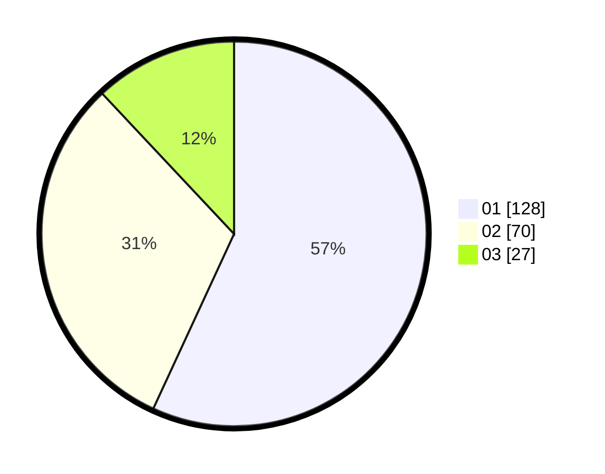

# Hasil

Hasil perolehan suara paslon dapat dilihat pada file paslon-01.txt, paslon-02.txt, dan paslon-03.txt.

Jika tidak ada, artinya data tersebut belum ada pada SIREKAP.

## Perolehan Suara

 * Paslon 01: **128**.
 * Paslon 02: **70**.
 * Paslon 03: **27**.

## Foto C Plano

https://sirekap-obj-formc.kpu.go.id/25c0/pemilu/ppwp/31/75/03/10/08/3175031008067-20240214-184642--1d488ac9-58f1-481c-9b86-c92525565724.jpg

https://sirekap-obj-formc.kpu.go.id/25c0/pemilu/ppwp/31/75/03/10/08/3175031008067-20240214-184645--6bfd58cb-4b83-47ec-88d1-1bd50f2471e9.jpg

https://sirekap-obj-formc.kpu.go.id/25c0/pemilu/ppwp/31/75/03/10/08/3175031008067-20240214-184648--42170edb-e46b-4371-bde7-b806d965f4b6.jpg

## DATA PEMILIH TETAP

Jumlah pemilih dalam DPT: **273**.
 * L: **135**.
 * P: **138**.

## DATA PENGGUNA HAK PILIH

Jumlah pengguna hak pilih dalam DPT: **228**.
 * L: **109**.
 * P: **119**.

Jumlah pengguna hak pilih dalam DPTb: **2**.
 * L: **1**.
 * P: **1**.

Jumlah pengguna hak pilih dalam DPK: **0**.
 * L: **1**.
 * P: **0**.

Jumlah pengguna hak pilih: **231**.
 * L: **111**.
 * P: **120**.

## JUMLAH SUARA SAH DAN TIDAK SAH

JUMLAH SELURUH SUARA SAH: **225**.

JUMLAH SUARA TIDAK SAH: **6**.

JUMLAH SELURUH SUARA SAH DAN SUARA TIDAK SAH: **231**.
