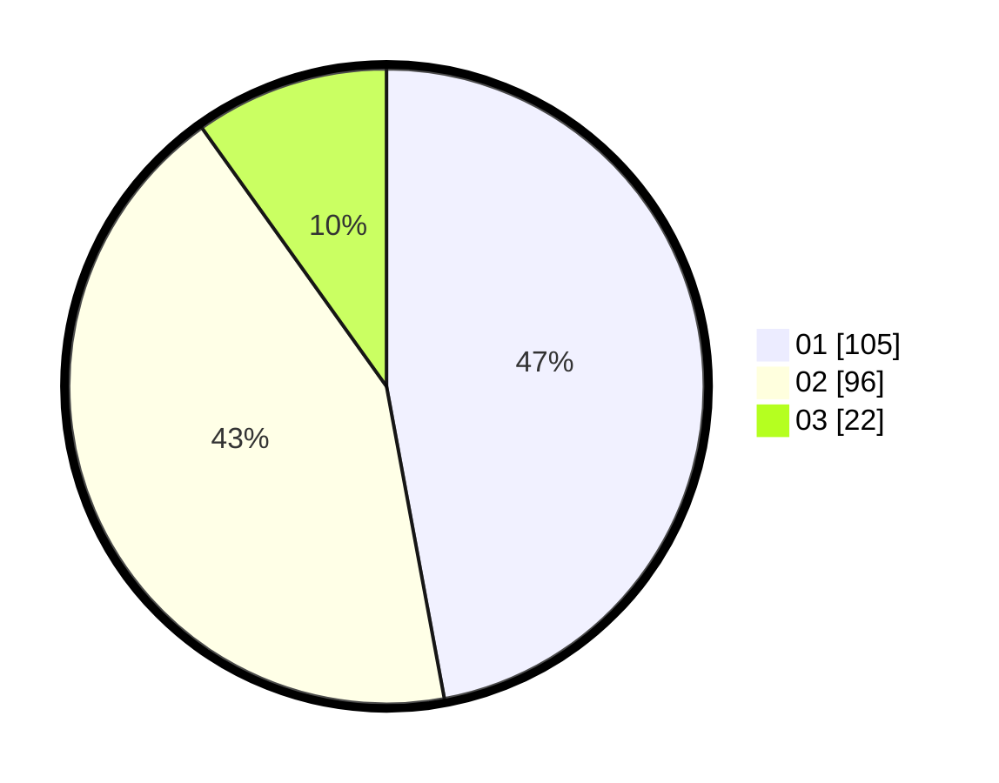

# Hasil

Hasil perolehan suara paslon dapat dilihat pada file paslon-01.txt, paslon-02.txt, dan paslon-03.txt.

Jika tidak ada, artinya data tersebut belum ada pada SIREKAP.

## Perolehan Suara

 * Paslon 01: **105**.
 * Paslon 02: **96**.
 * Paslon 03: **22**.

## Foto C Plano

https://sirekap-obj-formc.kpu.go.id/6b71/pemilu/ppwp/31/75/03/10/08/3175031008068-20240214-191011--a5579ac3-4a49-4152-9415-46a1c07fb76a.jpg

https://sirekap-obj-formc.kpu.go.id/6b71/pemilu/ppwp/31/75/03/10/08/3175031008068-20240214-191158--db93c959-c92a-4b9a-b9b2-d5387198cfd3.jpg

https://sirekap-obj-formc.kpu.go.id/6b71/pemilu/ppwp/31/75/03/10/08/3175031008068-20240214-191105--a20333c7-a778-4f70-b638-6dd56d3b4d9c.jpg

## DATA PEMILIH TETAP

Jumlah pemilih dalam DPT: **298**.
 * L: **150**.
 * P: **148**.

## DATA PENGGUNA HAK PILIH

Jumlah pengguna hak pilih dalam DPT: **223**.
 * L: **109**.
 * P: **114**.

Jumlah pengguna hak pilih dalam DPTb: **0**.
 * L: **0**.
 * P: **0**.

Jumlah pengguna hak pilih dalam DPK: **0**.
 * L: **0**.
 * P: **0**.

Jumlah pengguna hak pilih: **223**.
 * L: **109**.
 * P: **114**.

## JUMLAH SUARA SAH DAN TIDAK SAH

JUMLAH SELURUH SUARA SAH: **223**.

JUMLAH SUARA TIDAK SAH: **0**.

JUMLAH SELURUH SUARA SAH DAN SUARA TIDAK SAH: **223**.
