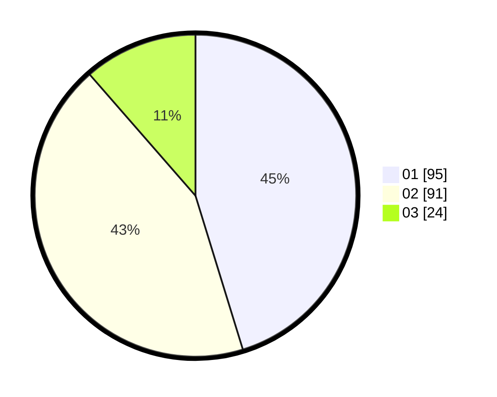

# Hasil

Hasil perolehan suara paslon dapat dilihat pada file paslon-01.txt, paslon-02.txt, dan paslon-03.txt.

Jika tidak ada, artinya data tersebut belum ada pada SIREKAP.

## Perolehan Suara

 * Paslon 01: **95**.
 * Paslon 02: **91**.
 * Paslon 03: **24**.

## Foto C Plano

https://sirekap-obj-formc.kpu.go.id/8889/pemilu/ppwp/31/75/03/10/08/3175031008071-20240216-144603--39ecebb1-2b10-485a-9107-8c99c1538fbb.jpg

https://sirekap-obj-formc.kpu.go.id/8889/pemilu/ppwp/31/75/03/10/08/3175031008071-20240216-144605--6265222b-a44c-4e94-85c9-c2f78a30163b.jpg

https://sirekap-obj-formc.kpu.go.id/8889/pemilu/ppwp/31/75/03/10/08/3175031008071-20240216-144604--cb082a63-9a0b-4e21-a04d-e72bdf2e7536.jpg

## DATA PEMILIH TETAP

Jumlah pemilih dalam DPT: **294**.
 * L: **140**.
 * P: **154**.

## DATA PENGGUNA HAK PILIH

Jumlah pengguna hak pilih dalam DPT: **213**.
 * L: **100**.
 * P: **113**.

Jumlah pengguna hak pilih dalam DPTb: **0**.
 * L: **0**.
 * P: **0**.

Jumlah pengguna hak pilih dalam DPK: **1**.
 * L: **1**.
 * P: **0**.

Jumlah pengguna hak pilih: **214**.
 * L: **101**.
 * P: **113**.

## JUMLAH SUARA SAH DAN TIDAK SAH

JUMLAH SELURUH SUARA SAH: **210**.

JUMLAH SUARA TIDAK SAH: **4**.

JUMLAH SELURUH SUARA SAH DAN SUARA TIDAK SAH: **214**.
