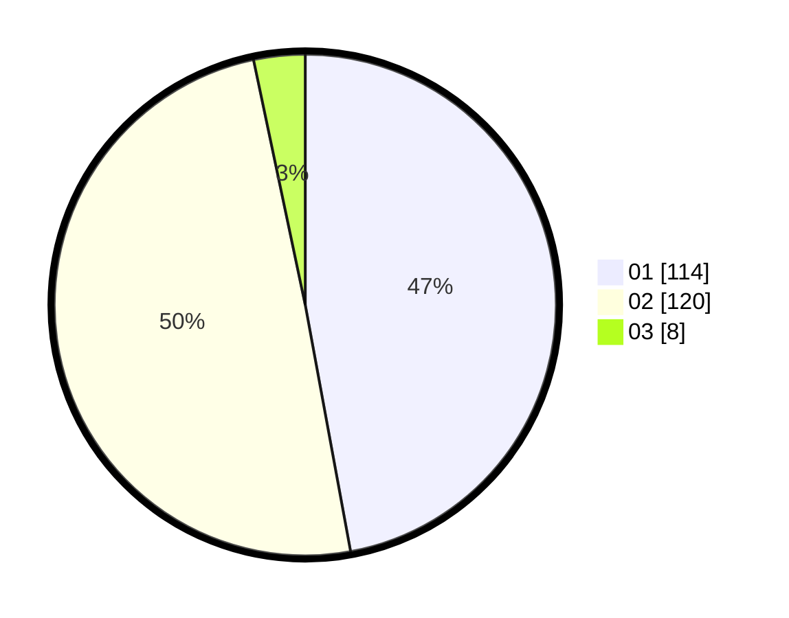

# Hasil

Hasil perolehan suara paslon dapat dilihat pada file paslon-01.txt, paslon-02.txt, dan paslon-03.txt.

Jika tidak ada, artinya data tersebut belum ada pada SIREKAP.

## Perolehan Suara

 * Paslon 01: **114**.
 * Paslon 02: **120**.
 * Paslon 03: **8**.

## Foto C Plano

https://sirekap-obj-formc.kpu.go.id/e990/pemilu/ppwp/31/75/03/10/08/3175031008076-20240215-195322--f25daf72-f614-41e1-990d-b4d895cb7eba.jpg

https://sirekap-obj-formc.kpu.go.id/e990/pemilu/ppwp/31/75/03/10/08/3175031008076-20240215-195343--185e0cad-54b7-4c8f-8b78-bfe61a6824a0.jpg

https://sirekap-obj-formc.kpu.go.id/e990/pemilu/ppwp/31/75/03/10/08/3175031008076-20240215-195332--6452b2bf-0f9b-46ef-9b63-9ce0611707e5.jpg

## DATA PEMILIH TETAP

Jumlah pemilih dalam DPT: **292**.
 * L: **143**.
 * P: **149**.

## DATA PENGGUNA HAK PILIH

Jumlah pengguna hak pilih dalam DPT: **236**.
 * L: **112**.
 * P: **124**.

Jumlah pengguna hak pilih dalam DPTb: **2**.
 * L: **0**.
 * P: **2**.

Jumlah pengguna hak pilih dalam DPK: **6**.
 * L: **2**.
 * P: **4**.

Jumlah pengguna hak pilih: **244**.
 * L: **114**.
 * P: **130**.

## JUMLAH SUARA SAH DAN TIDAK SAH

JUMLAH SELURUH SUARA SAH: **242**.

JUMLAH SUARA TIDAK SAH: **3**.

JUMLAH SELURUH SUARA SAH DAN SUARA TIDAK SAH: **245**.
