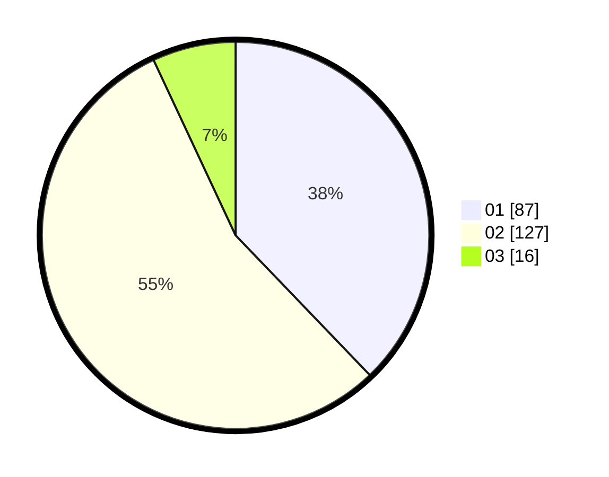

# Hasil

Hasil perolehan suara paslon dapat dilihat pada file paslon-01.txt, paslon-02.txt, dan paslon-03.txt.

Jika tidak ada, artinya data tersebut belum ada pada SIREKAP.

## Perolehan Suara

 * Paslon 01: **87**.
 * Paslon 02: **127**.
 * Paslon 03: **16**.

## Foto C Plano

https://sirekap-obj-formc.kpu.go.id/534e/pemilu/ppwp/31/75/03/10/08/3175031008077-20240214-195523--399d6788-1fac-48a7-9660-2e0fc76b047b.jpg

https://sirekap-obj-formc.kpu.go.id/534e/pemilu/ppwp/31/75/03/10/08/3175031008077-20240214-230150--afd59e0b-2c17-4bb9-9e69-9f35d9661180.jpg

https://sirekap-obj-formc.kpu.go.id/534e/pemilu/ppwp/31/75/03/10/08/3175031008077-20240214-195802--1d6288f7-2328-43f2-b38f-af68297d920c.jpg
