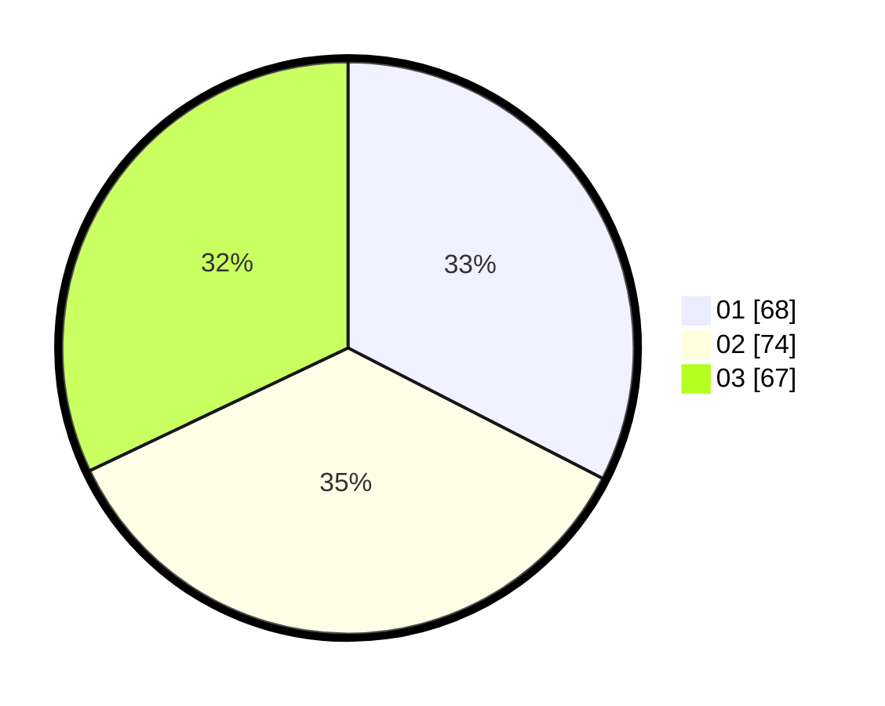

# Hasil

Hasil perolehan suara paslon dapat dilihat pada file paslon-01.txt, paslon-02.txt, dan paslon-03.txt.

Jika tidak ada, artinya data tersebut belum ada pada SIREKAP.

## Perolehan Suara

 * Paslon 01: **68**.
 * Paslon 02: **74**.
 * Paslon 03: **67**.

## Foto C Plano

https://sirekap-obj-formc.kpu.go.id/9e1e/pemilu/ppwp/31/75/03/10/08/3175031008087-20240214-201404--27245f44-ea2d-4c2f-a59d-e532569b546f.jpg

https://sirekap-obj-formc.kpu.go.id/9e1e/pemilu/ppwp/31/75/03/10/08/3175031008087-20240214-193840--6b5b4257-a79e-4f49-972f-68ffee636249.jpg

https://sirekap-obj-formc.kpu.go.id/9e1e/pemilu/ppwp/31/75/03/10/08/3175031008087-20240214-194054--7daf8382-4172-4445-877c-fb815e2a426a.jpg

## DATA PEMILIH TETAP

Jumlah pemilih dalam DPT: **267**.
 * L: **137**.
 * P: **130**.

## DATA PENGGUNA HAK PILIH

Jumlah pengguna hak pilih dalam DPT: **215**.
 * L: **102**.
 * P: **113**.

Jumlah pengguna hak pilih dalam DPTb: **0**.
 * L: **0**.
 * P: **0**.

Jumlah pengguna hak pilih dalam DPK: **1**.
 * L: **1**.
 * P: **0**.

Jumlah pengguna hak pilih: **216**.
 * L: **103**.
 * P: **113**.

## JUMLAH SUARA SAH DAN TIDAK SAH

JUMLAH SELURUH SUARA SAH: **209**.

JUMLAH SUARA TIDAK SAH: **7**.

JUMLAH SELURUH SUARA SAH DAN SUARA TIDAK SAH: **216**.
