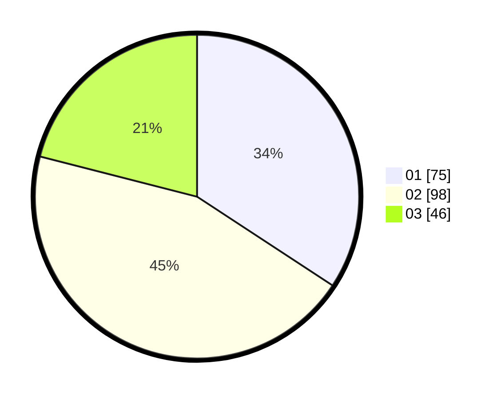

# Hasil

Hasil perolehan suara paslon dapat dilihat pada file paslon-01.txt, paslon-02.txt, dan paslon-03.txt.

Jika tidak ada, artinya data tersebut belum ada pada SIREKAP.

## Perolehan Suara

 * Paslon 01: **75**.
 * Paslon 02: **98**.
 * Paslon 03: **46**.

## Foto C Plano

https://sirekap-obj-formc.kpu.go.id/1c5d/pemilu/ppwp/31/75/03/10/08/3175031008093-20240214-214059--d860dbd4-d5c5-4f43-b982-67039022cca2.jpg

https://sirekap-obj-formc.kpu.go.id/1c5d/pemilu/ppwp/31/75/03/10/08/3175031008093-20240215-220612--c67ccedd-ad93-4f95-95c8-84a766efc42a.jpg

https://sirekap-obj-formc.kpu.go.id/1c5d/pemilu/ppwp/31/75/03/10/08/3175031008093-20240215-222920--2f7e9d46-96b0-4208-8c08-2138196a264e.jpg

## DATA PEMILIH TETAP

Jumlah pemilih dalam DPT: **276**.
 * L: **151**.
 * P: **125**.

## DATA PENGGUNA HAK PILIH

Jumlah pengguna hak pilih dalam DPT: **224**.
 * L: **120**.
 * P: **104**.

Jumlah pengguna hak pilih dalam DPTb: **0**.
 * L: **0**.
 * P: **0**.

Jumlah pengguna hak pilih dalam DPK: **0**.
 * L: **0**.
 * P: **0**.

Jumlah pengguna hak pilih: **224**.
 * L: **120**.
 * P: **104**.

## JUMLAH SUARA SAH DAN TIDAK SAH

JUMLAH SELURUH SUARA SAH: **219**.

JUMLAH SUARA TIDAK SAH: **5**.

JUMLAH SELURUH SUARA SAH DAN SUARA TIDAK SAH: **224**.
