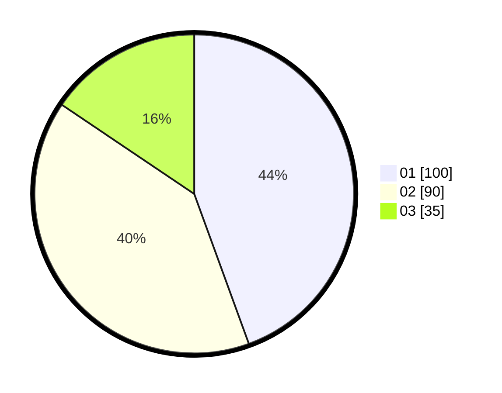

# Hasil

Hasil perolehan suara paslon dapat dilihat pada file paslon-01.txt, paslon-02.txt, dan paslon-03.txt.

Jika tidak ada, artinya data tersebut belum ada pada SIREKAP.

## Perolehan Suara

 * Paslon 01: **100**.
 * Paslon 02: **90**.
 * Paslon 03: **35**.

## Foto C Plano

https://sirekap-obj-formc.kpu.go.id/483a/pemilu/ppwp/31/75/03/10/08/3175031008095-20240214-223923--339c9378-ad6e-4a74-b822-08023c6084c7.jpg

https://sirekap-obj-formc.kpu.go.id/483a/pemilu/ppwp/31/75/03/10/08/3175031008095-20240214-212003--b3c55761-8a32-4219-8e16-4e6257c20ea8.jpg

https://sirekap-obj-formc.kpu.go.id/483a/pemilu/ppwp/31/75/03/10/08/3175031008095-20240214-211752--4ddd734a-e58c-4819-97ff-9089473f0e01.jpg
