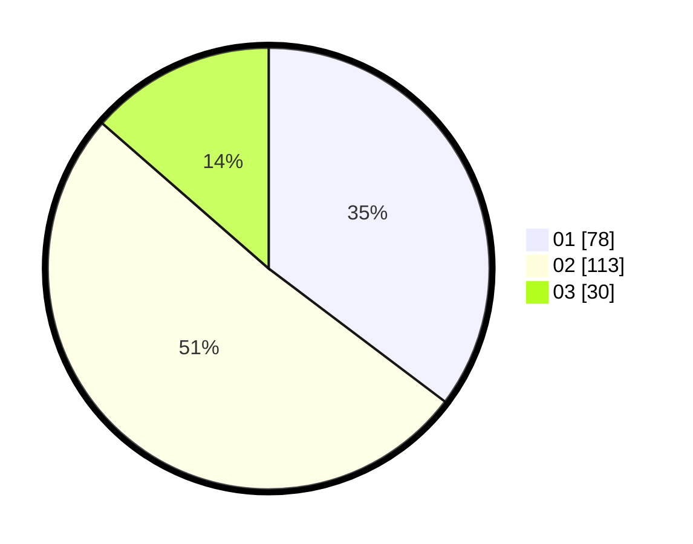

# Hasil

Hasil perolehan suara paslon dapat dilihat pada file paslon-01.txt, paslon-02.txt, dan paslon-03.txt.

Jika tidak ada, artinya data tersebut belum ada pada SIREKAP.

## Perolehan Suara

 * Paslon 01: **78**.
 * Paslon 02: **113**.
 * Paslon 03: **30**.

## Foto C Plano

https://sirekap-obj-formc.kpu.go.id/8d4f/pemilu/ppwp/31/75/03/10/08/3175031008096-20240214-155404--388ff27c-6fef-4e20-ba17-0bd0b0694203.jpg

https://sirekap-obj-formc.kpu.go.id/8d4f/pemilu/ppwp/31/75/03/10/08/3175031008096-20240214-160134--5467c321-f2a5-4d8d-9a8a-9bc8498a2888.jpg

https://sirekap-obj-formc.kpu.go.id/8d4f/pemilu/ppwp/31/75/03/10/08/3175031008096-20240214-155637--250ab769-19a7-4a2d-addc-9b5e7acac00c.jpg
