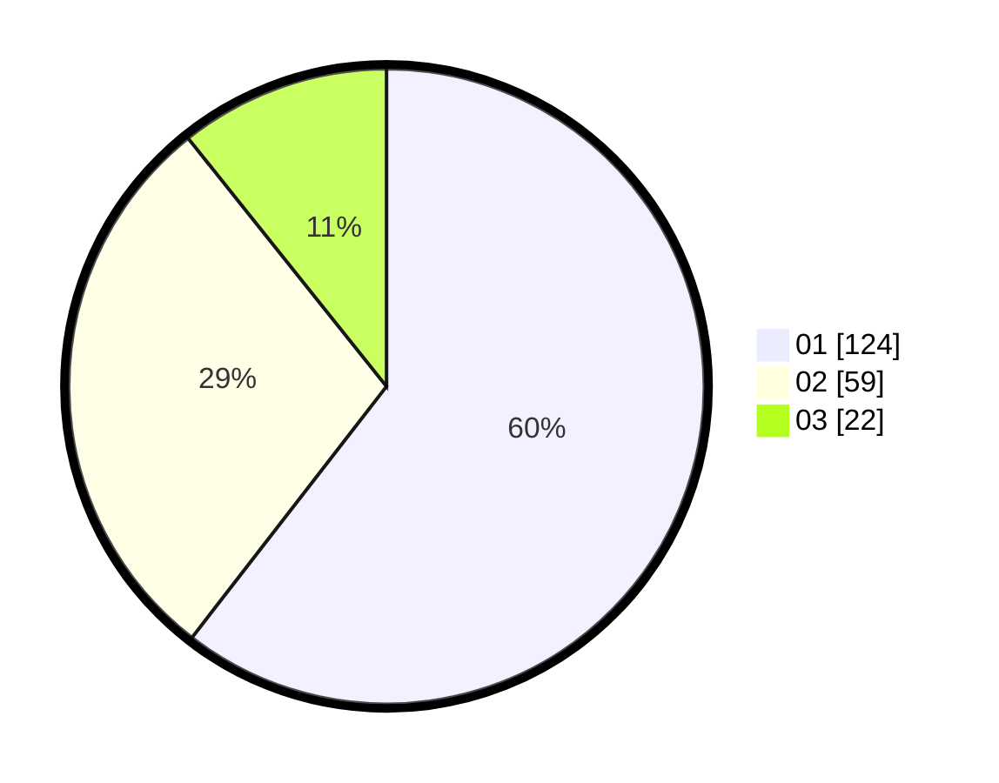

# Hasil

Hasil perolehan suara paslon dapat dilihat pada file paslon-01.txt, paslon-02.txt, dan paslon-03.txt.

Jika tidak ada, artinya data tersebut belum ada pada SIREKAP.

## Perolehan Suara

 * Paslon 01: **124**.
 * Paslon 02: **59**.
 * Paslon 03: **22**.

## Foto C Plano

https://sirekap-obj-formc.kpu.go.id/e7e2/pemilu/ppwp/31/75/03/10/08/3175031008102-20240214-185843--4345b7a2-1ec2-4cdf-8be6-5ff02cf95dcd.jpg

https://sirekap-obj-formc.kpu.go.id/e7e2/pemilu/ppwp/31/75/03/10/08/3175031008102-20240216-142747--2c0c94bd-33ea-46ee-b7d2-a5eb0bc31fa4.jpg

https://sirekap-obj-formc.kpu.go.id/e7e2/pemilu/ppwp/31/75/03/10/08/3175031008102-20240214-162226--cb1fedef-43d2-4a2b-a5bc-119ff87a9da8.jpg

## DATA PEMILIH TETAP

Jumlah pemilih dalam DPT: **278**.
 * L: **137**.
 * P: **141**.

## DATA PENGGUNA HAK PILIH

Jumlah pengguna hak pilih dalam DPT: **201**.
 * L: **95**.
 * P: **106**.

Jumlah pengguna hak pilih dalam DPTb: **6**.
 * L: **3**.
 * P: **3**.

Jumlah pengguna hak pilih dalam DPK: **4**.
 * L: **1**.
 * P: **3**.

Jumlah pengguna hak pilih: **211**.
 * L: **99**.
 * P: **112**.

## JUMLAH SUARA SAH DAN TIDAK SAH

JUMLAH SELURUH SUARA SAH: **205**.

JUMLAH SUARA TIDAK SAH: **6**.

JUMLAH SELURUH SUARA SAH DAN SUARA TIDAK SAH: **211**.
