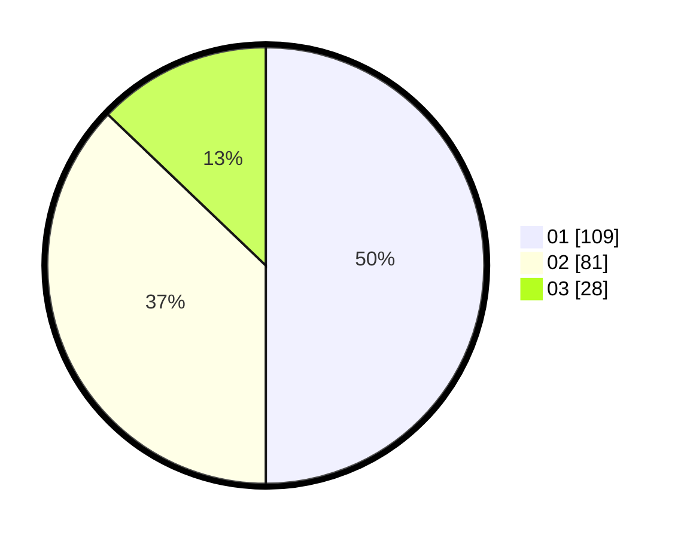

# Hasil

Hasil perolehan suara paslon dapat dilihat pada file paslon-01.txt, paslon-02.txt, dan paslon-03.txt.

Jika tidak ada, artinya data tersebut belum ada pada SIREKAP.

## Perolehan Suara

 * Paslon 01: **109**.
 * Paslon 02: **81**.
 * Paslon 03: **28**.

## Foto C Plano

https://sirekap-obj-formc.kpu.go.id/6ca9/pemilu/ppwp/31/75/03/10/08/3175031008103-20240215-142129--2ac4cf39-dde0-450c-b6e3-217c9640525e.jpg

https://sirekap-obj-formc.kpu.go.id/6ca9/pemilu/ppwp/31/75/03/10/08/3175031008103-20240215-142151--76d89c76-4907-4fcb-95a0-91e95ec42dbf.jpg

https://sirekap-obj-formc.kpu.go.id/6ca9/pemilu/ppwp/31/75/03/10/08/3175031008103-20240215-142140--b06e385a-f221-43d7-881e-34ed7e2b2921.jpg

## DATA PEMILIH TETAP

Jumlah pemilih dalam DPT: **277**.
 * L: **132**.
 * P: **145**.

## DATA PENGGUNA HAK PILIH

Jumlah pengguna hak pilih dalam DPT: **221**.
 * L: **103**.
 * P: **118**.

Jumlah pengguna hak pilih dalam DPTb: **0**.
 * L: **0**.
 * P: **0**.

Jumlah pengguna hak pilih dalam DPK: **0**.
 * L: **0**.
 * P: **0**.

Jumlah pengguna hak pilih: **221**.
 * L: **103**.
 * P: **118**.

## JUMLAH SUARA SAH DAN TIDAK SAH

JUMLAH SELURUH SUARA SAH: **218**.

JUMLAH SUARA TIDAK SAH: **3**.

JUMLAH SELURUH SUARA SAH DAN SUARA TIDAK SAH: **221**.
