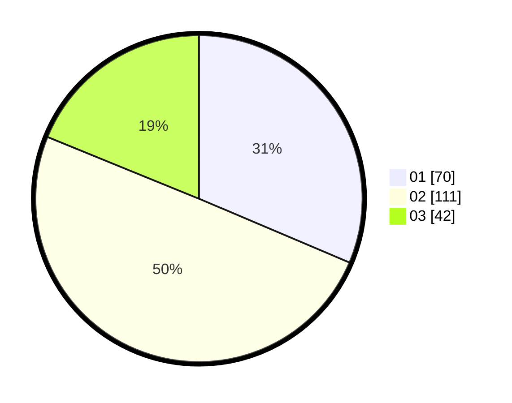

# Hasil

Hasil perolehan suara paslon dapat dilihat pada file paslon-01.txt, paslon-02.txt, dan paslon-03.txt.

Jika tidak ada, artinya data tersebut belum ada pada SIREKAP.

## Perolehan Suara

 * Paslon 01: **70**.
 * Paslon 02: **111**.
 * Paslon 03: **42**.

## Foto C Plano

https://sirekap-obj-formc.kpu.go.id/6d13/pemilu/ppwp/31/75/03/10/08/3175031008109-20240214-155429--dee8a34c-4343-444b-858c-aa90b64bef95.jpg

https://sirekap-obj-formc.kpu.go.id/6d13/pemilu/ppwp/31/75/03/10/08/3175031008109-20240214-215436--0e17dade-67f1-4f6e-a5c1-a6cf555e8a10.jpg
