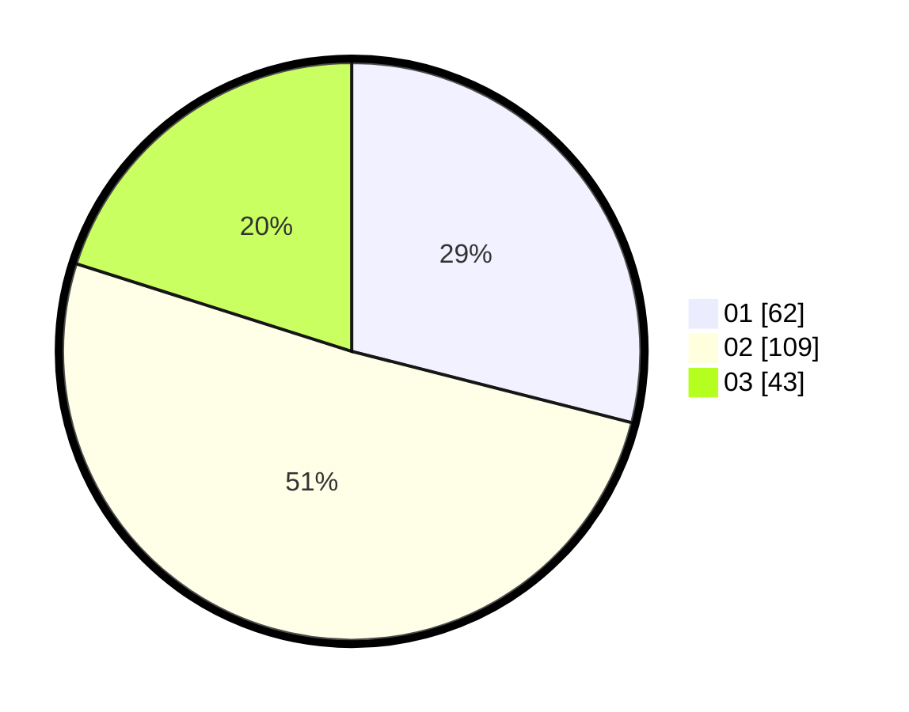

# Hasil

Hasil perolehan suara paslon dapat dilihat pada file paslon-01.txt, paslon-02.txt, dan paslon-03.txt.

Jika tidak ada, artinya data tersebut belum ada pada SIREKAP.

## Perolehan Suara

 * Paslon 01: **62**.
 * Paslon 02: **109**.
 * Paslon 03: **43**.

## Foto C Plano

https://sirekap-obj-formc.kpu.go.id/6504/pemilu/ppwp/31/75/03/10/08/3175031008110-20240215-215937--16167caf-fd35-45ad-86e5-8765ffca1c74.jpg

https://sirekap-obj-formc.kpu.go.id/6504/pemilu/ppwp/31/75/03/10/08/3175031008110-20240215-215940--547bbcb5-cb01-4427-b916-35261287900f.jpg

https://sirekap-obj-formc.kpu.go.id/6504/pemilu/ppwp/31/75/03/10/08/3175031008110-20240215-215939--a9b3959d-cbc6-4898-9b5c-28c36df55e19.jpg

## DATA PEMILIH TETAP

Jumlah pemilih dalam DPT: **278**.
 * L: **151**.
 * P: **127**.

## DATA PENGGUNA HAK PILIH

Jumlah pengguna hak pilih dalam DPT: **215**.
 * L: **114**.
 * P: **101**.

Jumlah pengguna hak pilih dalam DPTb: **2**.
 * L: **1**.
 * P: **1**.

Jumlah pengguna hak pilih dalam DPK: **2**.
 * L: **1**.
 * P: **1**.

Jumlah pengguna hak pilih: **219**.
 * L: **116**.
 * P: **103**.

## JUMLAH SUARA SAH DAN TIDAK SAH

JUMLAH SELURUH SUARA SAH: **214**.

JUMLAH SUARA TIDAK SAH: **5**.

JUMLAH SELURUH SUARA SAH DAN SUARA TIDAK SAH: **219**.
