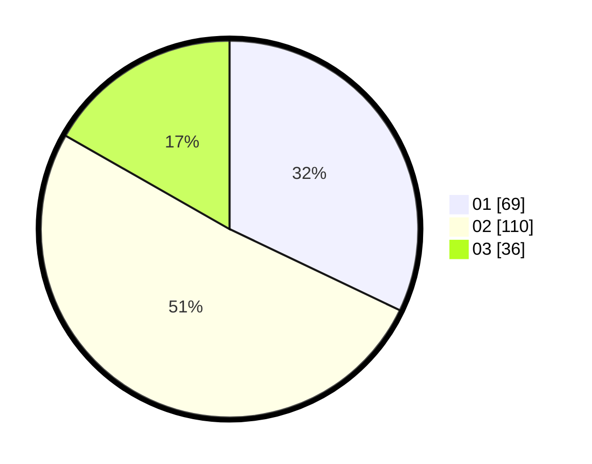

# Hasil

Hasil perolehan suara paslon dapat dilihat pada file paslon-01.txt, paslon-02.txt, dan paslon-03.txt.

Jika tidak ada, artinya data tersebut belum ada pada SIREKAP.

## Perolehan Suara

 * Paslon 01: **69**.
 * Paslon 02: **110**.
 * Paslon 03: **36**.

## Foto C Plano

https://sirekap-obj-formc.kpu.go.id/3f77/pemilu/ppwp/31/75/03/10/08/3175031008111-20240214-211315--5f8437a6-34ea-4ce2-80b4-be6e43139897.jpg

https://sirekap-obj-formc.kpu.go.id/3f77/pemilu/ppwp/31/75/03/10/08/3175031008111-20240214-211757--d8a12263-bf4e-474a-b266-2f50838d0b37.jpg

https://sirekap-obj-formc.kpu.go.id/3f77/pemilu/ppwp/31/75/03/10/08/3175031008111-20240214-211923--9054dc75-22cc-460c-828c-b73daa68a449.jpg
