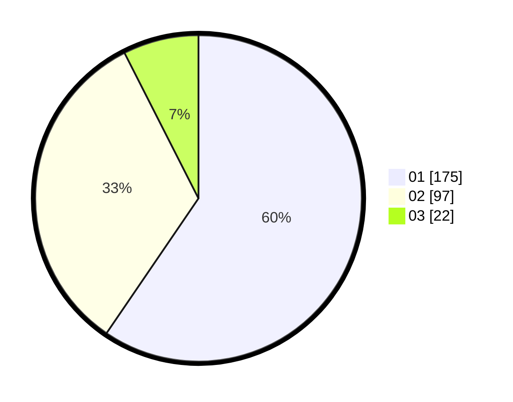

# Hasil

Hasil perolehan suara paslon dapat dilihat pada file paslon-01.txt, paslon-02.txt, dan paslon-03.txt.

Jika tidak ada, artinya data tersebut belum ada pada SIREKAP.

## Perolehan Suara

 * Paslon 01: **175**.
 * Paslon 02: **97**.
 * Paslon 03: **22**.

## Foto C Plano

https://sirekap-obj-formc.kpu.go.id/b0fd/pemilu/ppwp/31/75/03/10/08/3175031008113-20240214-220202--92175144-c880-408b-87e0-1521e9a69e82.jpg

https://sirekap-obj-formc.kpu.go.id/b0fd/pemilu/ppwp/31/75/03/10/08/3175031008113-20240214-220351--260f4a8d-2874-4ed0-a652-f02abce57501.jpg

https://sirekap-obj-formc.kpu.go.id/b0fd/pemilu/ppwp/31/75/03/10/08/3175031008113-20240214-220438--65512368-6de5-46e3-b593-2579a795c773.jpg
