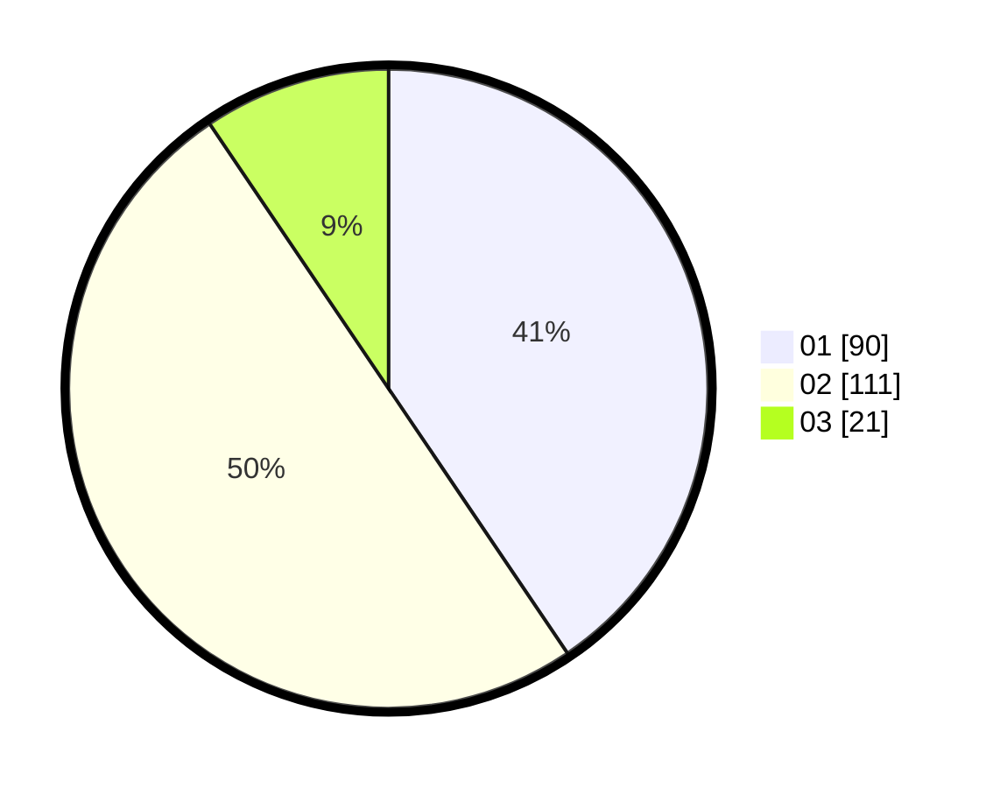

# Hasil

Hasil perolehan suara paslon dapat dilihat pada file paslon-01.txt, paslon-02.txt, dan paslon-03.txt.

Jika tidak ada, artinya data tersebut belum ada pada SIREKAP.

## Perolehan Suara

 * Paslon 01: **90**.
 * Paslon 02: **111**.
 * Paslon 03: **21**.

## Foto C Plano

https://sirekap-obj-formc.kpu.go.id/5cb1/pemilu/ppwp/31/75/03/10/08/3175031008115-20240215-153451--e7058b5a-56bc-4a92-8244-ab628aea172f.jpg

https://sirekap-obj-formc.kpu.go.id/5cb1/pemilu/ppwp/31/75/03/10/08/3175031008115-20240215-153551--8b907ce1-cf0e-432b-8fe9-dd390271f9d9.jpg

https://sirekap-obj-formc.kpu.go.id/5cb1/pemilu/ppwp/31/75/03/10/08/3175031008115-20240215-215130--b4aa8cb4-cda0-4e4d-bf81-68ab68d4b4a2.jpg
