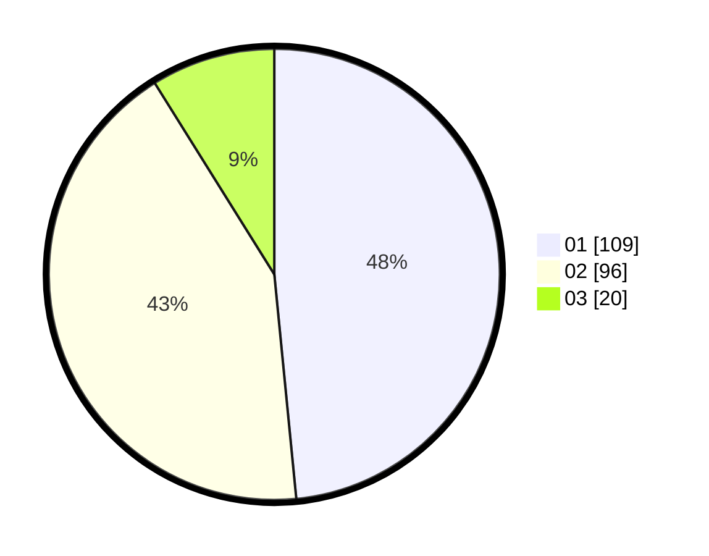

# Hasil

Hasil perolehan suara paslon dapat dilihat pada file paslon-01.txt, paslon-02.txt, dan paslon-03.txt.

Jika tidak ada, artinya data tersebut belum ada pada SIREKAP.

## Perolehan Suara

 * Paslon 01: **109**.
 * Paslon 02: **96**.
 * Paslon 03: **20**.

## Foto C Plano

https://sirekap-obj-formc.kpu.go.id/31a6/pemilu/ppwp/31/75/03/10/08/3175031008116-20240214-211127--314041c3-efd5-461b-83f7-ec7de0010dcb.jpg

https://sirekap-obj-formc.kpu.go.id/31a6/pemilu/ppwp/31/75/03/10/08/3175031008116-20240214-211314--7f05cc12-e098-4bc9-be9b-d0fb55061d72.jpg

https://sirekap-obj-formc.kpu.go.id/31a6/pemilu/ppwp/31/75/03/10/08/3175031008116-20240214-201536--8f6b7ff6-5cc6-4918-a880-85242446a1da.jpg
