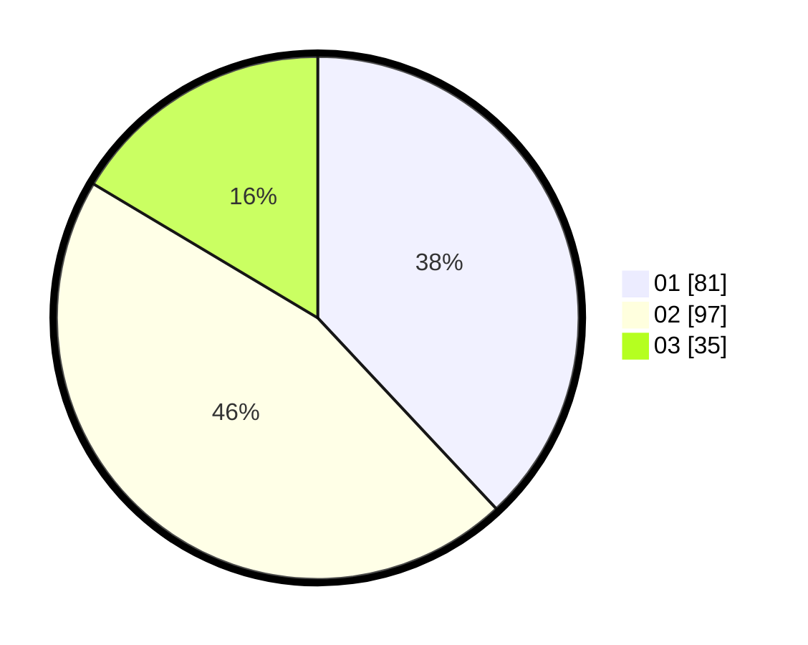

# Hasil

Hasil perolehan suara paslon dapat dilihat pada file paslon-01.txt, paslon-02.txt, dan paslon-03.txt.

Jika tidak ada, artinya data tersebut belum ada pada SIREKAP.

## Perolehan Suara

 * Paslon 01: **81**.
 * Paslon 02: **97**.
 * Paslon 03: **35**.

## Foto C Plano

https://sirekap-obj-formc.kpu.go.id/b867/pemilu/ppwp/31/75/03/10/08/3175031008121-20240215-205714--8f107a93-b3ec-45d7-9709-f1d8f9203519.jpg

https://sirekap-obj-formc.kpu.go.id/b867/pemilu/ppwp/31/75/03/10/08/3175031008121-20240215-205716--8c549bf7-f722-437b-8464-9c506d17fef8.jpg

https://sirekap-obj-formc.kpu.go.id/b867/pemilu/ppwp/31/75/03/10/08/3175031008121-20240215-205715--fe5d561b-1c3d-4ae3-85e5-d7ab58366ee7.jpg

## DATA PEMILIH TETAP

Jumlah pemilih dalam DPT: **0**.
 * L: **0**.
 * P: **0**.

## DATA PENGGUNA HAK PILIH

Jumlah pengguna hak pilih dalam DPT: **0**.
 * L: **0**.
 * P: **0**.

Jumlah pengguna hak pilih dalam DPTb: **0**.
 * L: **0**.
 * P: **0**.

Jumlah pengguna hak pilih dalam DPK: **0**.
 * L: **0**.
 * P: **0**.

Jumlah pengguna hak pilih: **0**.
 * L: **0**.
 * P: **0**.

## JUMLAH SUARA SAH DAN TIDAK SAH

JUMLAH SELURUH SUARA SAH: **213**.

JUMLAH SUARA TIDAK SAH: **7**.

JUMLAH SELURUH SUARA SAH DAN SUARA TIDAK SAH: **220**.
