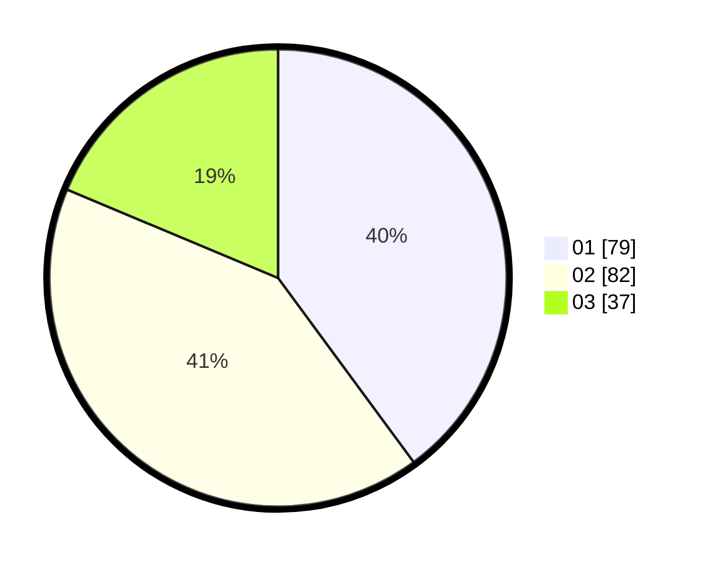

# Hasil

Hasil perolehan suara paslon dapat dilihat pada file paslon-01.txt, paslon-02.txt, dan paslon-03.txt.

Jika tidak ada, artinya data tersebut belum ada pada SIREKAP.

## Perolehan Suara

 * Paslon 01: **79**.
 * Paslon 02: **82**.
 * Paslon 03: **37**.

## Foto C Plano

https://sirekap-obj-formc.kpu.go.id/927d/pemilu/ppwp/31/75/03/10/08/3175031008122-20240214-230429--f093f871-c4ba-4f67-a1a0-a40178ad9f5d.jpg

https://sirekap-obj-formc.kpu.go.id/927d/pemilu/ppwp/31/75/03/10/08/3175031008122-20240214-234821--5b22076b-619f-42f4-856e-36ea843a3d70.jpg

https://sirekap-obj-formc.kpu.go.id/927d/pemilu/ppwp/31/75/03/10/08/3175031008122-20240214-234843--c1d3d36e-1afb-4190-82ed-2c3726ed776d.jpg
