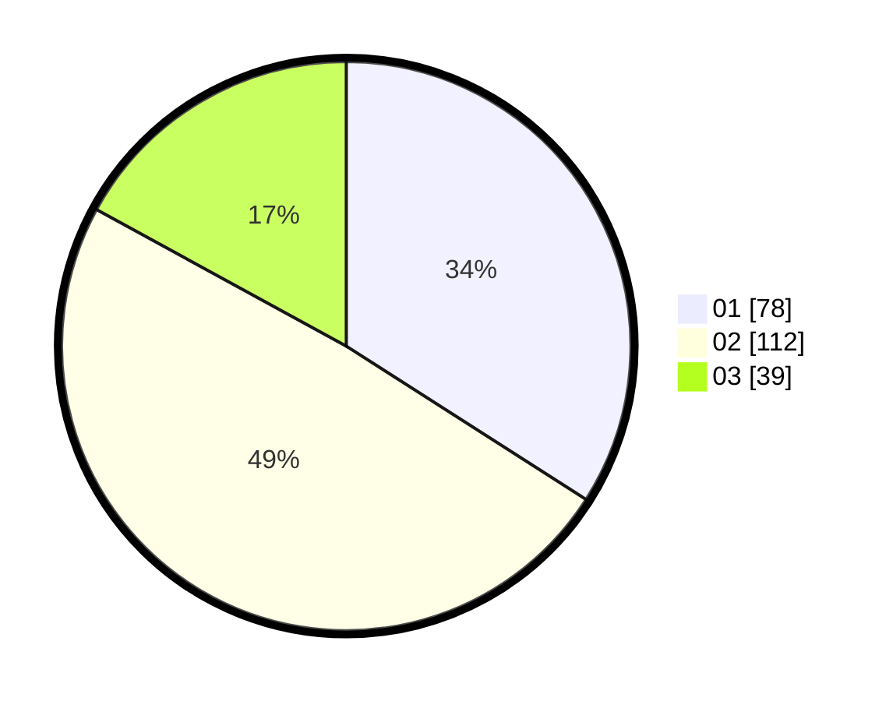

# Hasil

Hasil perolehan suara paslon dapat dilihat pada file paslon-01.txt, paslon-02.txt, dan paslon-03.txt.

Jika tidak ada, artinya data tersebut belum ada pada SIREKAP.

## Perolehan Suara

 * Paslon 01: **78**.
 * Paslon 02: **112**.
 * Paslon 03: **39**.

## Foto C Plano

https://sirekap-obj-formc.kpu.go.id/8a89/pemilu/ppwp/31/75/03/10/08/3175031008130-20240216-144943--e968a5de-9fd4-4979-a558-810781ba34ed.jpg

https://sirekap-obj-formc.kpu.go.id/8a89/pemilu/ppwp/31/75/03/10/08/3175031008130-20240216-214121--c4f70ad6-4918-440d-ada8-ae88e61812a6.jpg

https://sirekap-obj-formc.kpu.go.id/8a89/pemilu/ppwp/31/75/03/10/08/3175031008130-20240216-144944--f048733f-b09e-4ed8-b8f8-210358d67c75.jpg

## DATA PEMILIH TETAP

Jumlah pemilih dalam DPT: **287**.
 * L: **147**.
 * P: **140**.

## DATA PENGGUNA HAK PILIH

Jumlah pengguna hak pilih dalam DPT: **229**.
 * L: **117**.
 * P: **112**.

Jumlah pengguna hak pilih dalam DPTb: **0**.
 * L: **0**.
 * P: **0**.

Jumlah pengguna hak pilih dalam DPK: **2**.
 * L: **0**.
 * P: **2**.

Jumlah pengguna hak pilih: **231**.
 * L: **117**.
 * P: **114**.

## JUMLAH SUARA SAH DAN TIDAK SAH

JUMLAH SELURUH SUARA SAH: **229**.

JUMLAH SUARA TIDAK SAH: **2**.

JUMLAH SELURUH SUARA SAH DAN SUARA TIDAK SAH: **231**.
