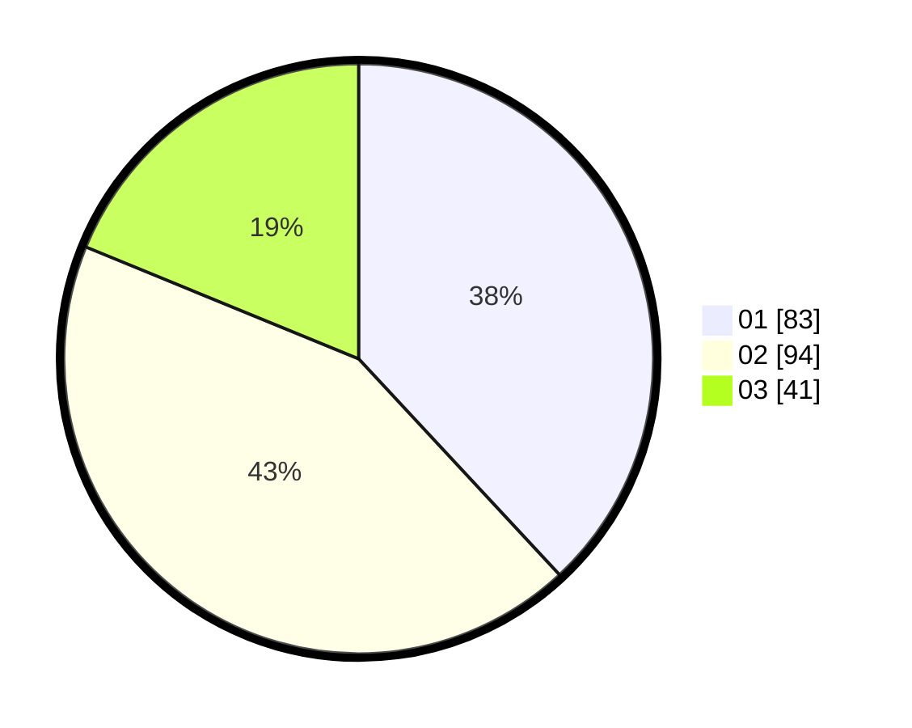

# Hasil

Hasil perolehan suara paslon dapat dilihat pada file paslon-01.txt, paslon-02.txt, dan paslon-03.txt.

Jika tidak ada, artinya data tersebut belum ada pada SIREKAP.

## Perolehan Suara

 * Paslon 01: **83**.
 * Paslon 02: **94**.
 * Paslon 03: **41**.

## Foto C Plano

https://sirekap-obj-formc.kpu.go.id/8a8a/pemilu/ppwp/31/75/03/10/08/3175031008131-20240216-062308--bf54d1ba-95fa-47a9-94f0-d67d0c461c9d.jpg

https://sirekap-obj-formc.kpu.go.id/8a8a/pemilu/ppwp/31/75/03/10/08/3175031008131-20240216-062310--ac1a7017-04c2-49e3-a0e7-e905cfdf2363.jpg

https://sirekap-obj-formc.kpu.go.id/8a8a/pemilu/ppwp/31/75/03/10/08/3175031008131-20240216-062309--14a4656b-1fee-4d7e-8701-9607af20958d.jpg

## DATA PEMILIH TETAP

Jumlah pemilih dalam DPT: **0**.
 * L: **0**.
 * P: **0**.

## DATA PENGGUNA HAK PILIH

Jumlah pengguna hak pilih dalam DPT: **0**.
 * L: **0**.
 * P: **0**.

Jumlah pengguna hak pilih dalam DPTb: **0**.
 * L: **0**.
 * P: **0**.

Jumlah pengguna hak pilih dalam DPK: **0**.
 * L: **0**.
 * P: **0**.

Jumlah pengguna hak pilih: **0**.
 * L: **0**.
 * P: **0**.

## JUMLAH SUARA SAH DAN TIDAK SAH

JUMLAH SELURUH SUARA SAH: **218**.

JUMLAH SUARA TIDAK SAH: **0**.

JUMLAH SELURUH SUARA SAH DAN SUARA TIDAK SAH: **218**.
