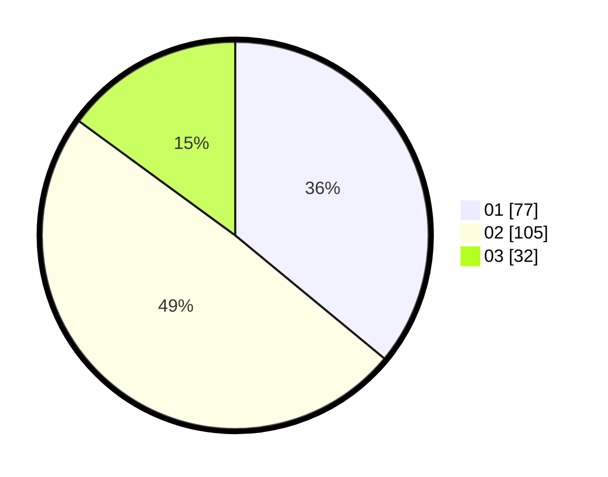

# Hasil

Hasil perolehan suara paslon dapat dilihat pada file paslon-01.txt, paslon-02.txt, dan paslon-03.txt.

Jika tidak ada, artinya data tersebut belum ada pada SIREKAP.

## Perolehan Suara

 * Paslon 01: **77**.
 * Paslon 02: **105**.
 * Paslon 03: **32**.

## Foto C Plano

https://sirekap-obj-formc.kpu.go.id/30ec/pemilu/ppwp/31/75/03/10/08/3175031008139-20240216-043053--7d9bcbcd-6667-4167-9ac1-0eaa6c39e754.jpg

https://sirekap-obj-formc.kpu.go.id/30ec/pemilu/ppwp/31/75/03/10/08/3175031008139-20240216-043055--589ebed6-f1dd-4553-91a1-6a6bdf2e1031.jpg

https://sirekap-obj-formc.kpu.go.id/30ec/pemilu/ppwp/31/75/03/10/08/3175031008139-20240216-043054--8a2a1adf-de95-4ab5-a585-0a2a3276e3e7.jpg

## DATA PEMILIH TETAP

Jumlah pemilih dalam DPT: **285**.
 * L: **146**.
 * P: **139**.

## DATA PENGGUNA HAK PILIH

Jumlah pengguna hak pilih dalam DPT: **220**.
 * L: **106**.
 * P: **114**.

Jumlah pengguna hak pilih dalam DPTb: **0**.
 * L: **0**.
 * P: **0**.

Jumlah pengguna hak pilih dalam DPK: **0**.
 * L: **0**.
 * P: **0**.

Jumlah pengguna hak pilih: **220**.
 * L: **106**.
 * P: **114**.

## JUMLAH SUARA SAH DAN TIDAK SAH

JUMLAH SELURUH SUARA SAH: **214**.

JUMLAH SUARA TIDAK SAH: **6**.

JUMLAH SELURUH SUARA SAH DAN SUARA TIDAK SAH: **220**.
