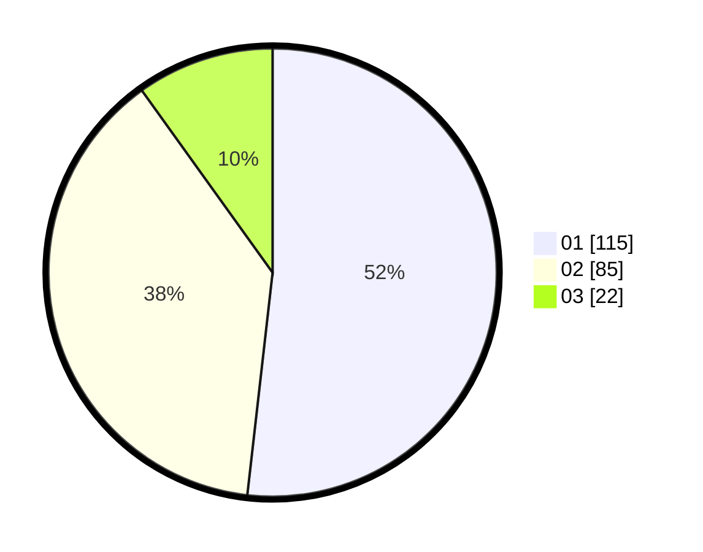

# Hasil

Hasil perolehan suara paslon dapat dilihat pada file paslon-01.txt, paslon-02.txt, dan paslon-03.txt.

Jika tidak ada, artinya data tersebut belum ada pada SIREKAP.

## Perolehan Suara

 * Paslon 01: **115**.
 * Paslon 02: **85**.
 * Paslon 03: **22**.

## Foto C Plano

https://sirekap-obj-formc.kpu.go.id/319d/pemilu/ppwp/31/75/03/10/08/3175031008150-20240214-202550--39990d24-f117-4106-808e-f40023cf29f5.jpg

https://sirekap-obj-formc.kpu.go.id/319d/pemilu/ppwp/31/75/03/10/08/3175031008150-20240214-194913--e6544546-1dd9-4ec6-85ba-1af2d1b581a9.jpg

https://sirekap-obj-formc.kpu.go.id/319d/pemilu/ppwp/31/75/03/10/08/3175031008150-20240214-195002--34fe690d-f3fd-4e1a-a5b6-e72712f21f0a.jpg

## DATA PEMILIH TETAP

Jumlah pemilih dalam DPT: **280**.
 * L: **135**.
 * P: **145**.

## DATA PENGGUNA HAK PILIH

Jumlah pengguna hak pilih dalam DPT: **218**.
 * L: **106**.
 * P: **112**.

Jumlah pengguna hak pilih dalam DPTb: **6**.
 * L: **4**.
 * P: **2**.

Jumlah pengguna hak pilih dalam DPK: **2**.
 * L: **2**.
 * P: **0**.

Jumlah pengguna hak pilih: **226**.
 * L: **112**.
 * P: **114**.

## JUMLAH SUARA SAH DAN TIDAK SAH

JUMLAH SELURUH SUARA SAH: **222**.

JUMLAH SUARA TIDAK SAH: **4**.

JUMLAH SELURUH SUARA SAH DAN SUARA TIDAK SAH: **226**.
