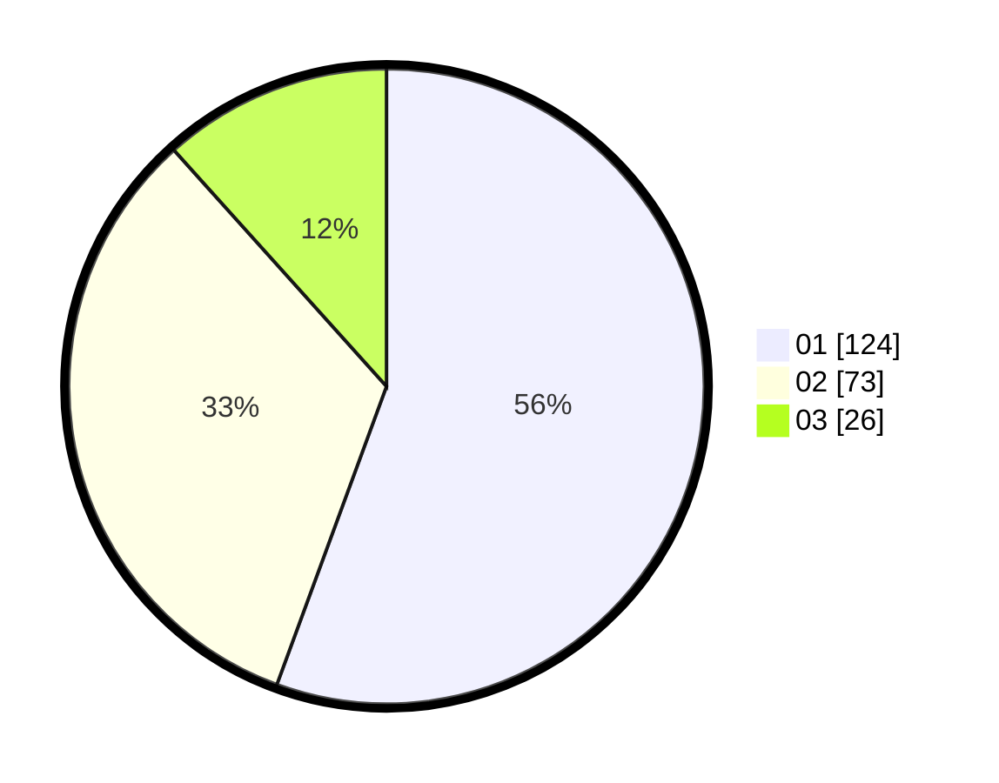

# Hasil

Hasil perolehan suara paslon dapat dilihat pada file paslon-01.txt, paslon-02.txt, dan paslon-03.txt.

Jika tidak ada, artinya data tersebut belum ada pada SIREKAP.

## Perolehan Suara

 * Paslon 01: **124**.
 * Paslon 02: **73**.
 * Paslon 03: **26**.

## Foto C Plano

https://sirekap-obj-formc.kpu.go.id/9403/pemilu/ppwp/31/75/03/10/08/3175031008151-20240216-055114--5032f490-55ed-4e4a-8a21-1e4cf7180e59.jpg

https://sirekap-obj-formc.kpu.go.id/9403/pemilu/ppwp/31/75/03/10/08/3175031008151-20240216-055118--f38a9307-04d8-4e4c-b7cb-9bd663ff6f1c.jpg

https://sirekap-obj-formc.kpu.go.id/9403/pemilu/ppwp/31/75/03/10/08/3175031008151-20240216-055115--76f75a7e-2a25-47d1-8e4a-8e83880ad709.jpg

## DATA PEMILIH TETAP

Jumlah pemilih dalam DPT: **281**.
 * L: **144**.
 * P: **137**.

## DATA PENGGUNA HAK PILIH

Jumlah pengguna hak pilih dalam DPT: **217**.
 * L: **112**.
 * P: **105**.

Jumlah pengguna hak pilih dalam DPTb: **8**.
 * L: **4**.
 * P: **4**.

Jumlah pengguna hak pilih dalam DPK: **0**.
 * L: **0**.
 * P: **0**.

Jumlah pengguna hak pilih: **225**.
 * L: **116**.
 * P: **109**.

## JUMLAH SUARA SAH DAN TIDAK SAH

JUMLAH SELURUH SUARA SAH: **223**.

JUMLAH SUARA TIDAK SAH: **2**.

JUMLAH SELURUH SUARA SAH DAN SUARA TIDAK SAH: **225**.
