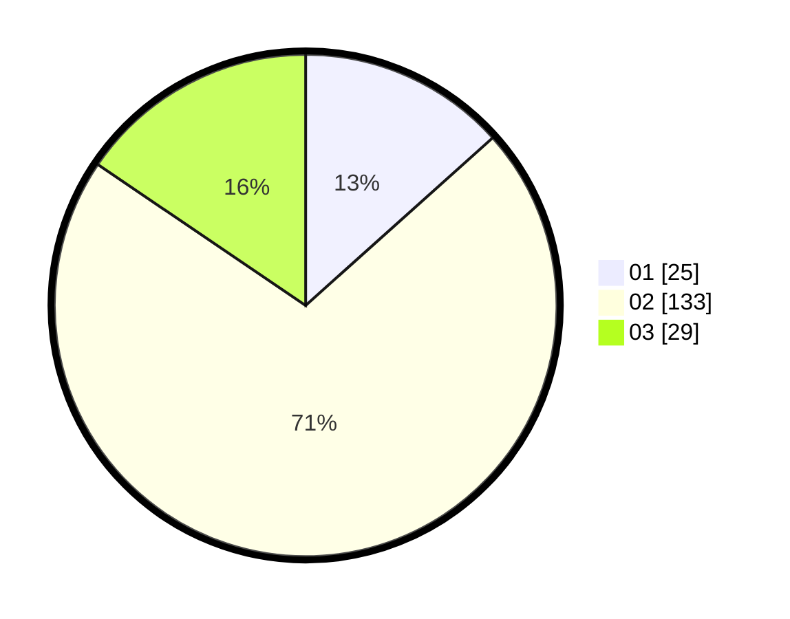

# Hasil

Hasil perolehan suara paslon dapat dilihat pada file paslon-01.txt, paslon-02.txt, dan paslon-03.txt.

Jika tidak ada, artinya data tersebut belum ada pada SIREKAP.

## Perolehan Suara

 * Paslon 01: **25**.
 * Paslon 02: **133**.
 * Paslon 03: **29**.

## Foto C Plano

https://sirekap-obj-formc.kpu.go.id/d927/pemilu/ppwp/31/75/03/10/08/3175031008905-20240214-195810--d9827b52-a992-4f88-bb72-1eaf46c1a756.jpg

https://sirekap-obj-formc.kpu.go.id/d927/pemilu/ppwp/31/75/03/10/08/3175031008905-20240214-195823--fa6fc8b1-db3e-4d68-b2bb-e1e66eeb8dac.jpg

https://sirekap-obj-formc.kpu.go.id/d927/pemilu/ppwp/31/75/03/10/08/3175031008905-20240214-195828--23d20def-5218-4dea-8506-d5454c77ead2.jpg
