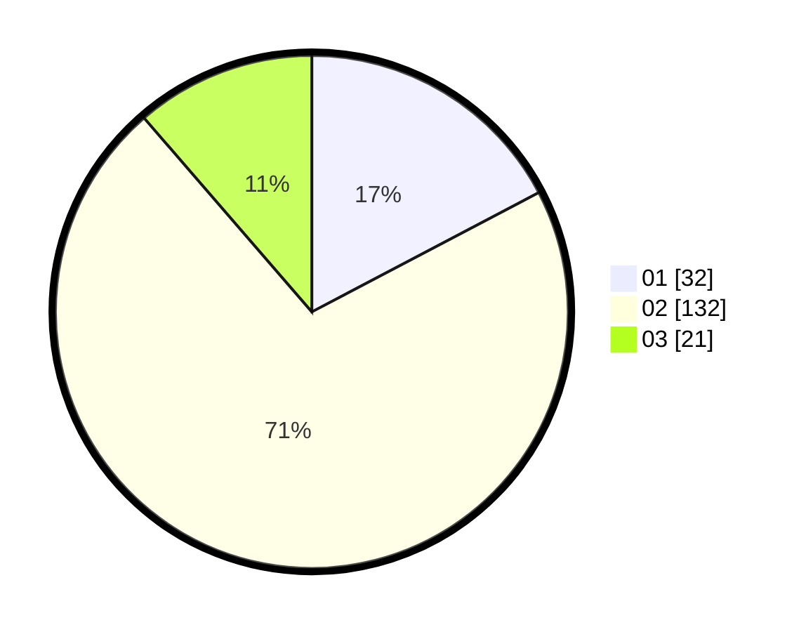

# Hasil

Hasil perolehan suara paslon dapat dilihat pada file paslon-01.txt, paslon-02.txt, dan paslon-03.txt.

Jika tidak ada, artinya data tersebut belum ada pada SIREKAP.

## Perolehan Suara

 * Paslon 01: **32**.
 * Paslon 02: **132**.
 * Paslon 03: **21**.

## Foto C Plano

https://sirekap-obj-formc.kpu.go.id/71c0/pemilu/ppwp/31/75/03/10/08/3175031008909-20240214-191320--d3b21c47-8270-4e92-bd19-0350bd24d492.jpg

https://sirekap-obj-formc.kpu.go.id/71c0/pemilu/ppwp/31/75/03/10/08/3175031008909-20240214-191339--33f5c817-245e-4b7a-a9ec-61effb3f7163.jpg

https://sirekap-obj-formc.kpu.go.id/71c0/pemilu/ppwp/31/75/03/10/08/3175031008909-20240214-191354--2406b54c-e174-4039-989a-76fadf03a81a.jpg

## DATA PEMILIH TETAP

Jumlah pemilih dalam DPT: **715**.
 * L: **715**.
 * P: **0**.

## DATA PENGGUNA HAK PILIH

Jumlah pengguna hak pilih dalam DPT: **167**.
 * L: **167**.
 * P: **0**.

Jumlah pengguna hak pilih dalam DPTb: **29**.
 * L: **27**.
 * P: **2**.

Jumlah pengguna hak pilih dalam DPK: **0**.
 * L: **0**.
 * P: **0**.

Jumlah pengguna hak pilih: **192**.
 * L: **190**.
 * P: **2**.

## JUMLAH SUARA SAH DAN TIDAK SAH

JUMLAH SELURUH SUARA SAH: **185**.

JUMLAH SUARA TIDAK SAH: **7**.

JUMLAH SELURUH SUARA SAH DAN SUARA TIDAK SAH: **192**.
