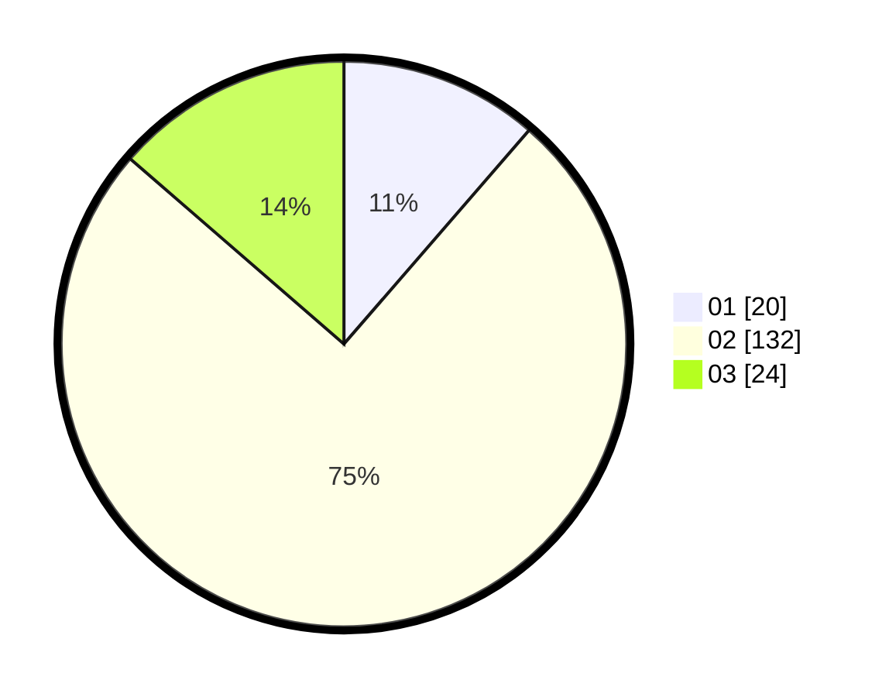

# Hasil

Hasil perolehan suara paslon dapat dilihat pada file paslon-01.txt, paslon-02.txt, dan paslon-03.txt.

Jika tidak ada, artinya data tersebut belum ada pada SIREKAP.

## Perolehan Suara

 * Paslon 01: **20**.
 * Paslon 02: **132**.
 * Paslon 03: **24**.

## Foto C Plano

https://sirekap-obj-formc.kpu.go.id/6c1a/pemilu/ppwp/31/75/03/10/08/3175031008910-20240214-201153--8457a1b3-502b-4742-a977-c2f680e97098.jpg

https://sirekap-obj-formc.kpu.go.id/6c1a/pemilu/ppwp/31/75/03/10/08/3175031008910-20240214-201243--3cfa390b-e61b-4dfa-b25b-a3b7102863ce.jpg

https://sirekap-obj-formc.kpu.go.id/6c1a/pemilu/ppwp/31/75/03/10/08/3175031008910-20240214-201321--27172e31-eeef-4681-8203-05c82dd3ca75.jpg

## DATA PEMILIH TETAP

Jumlah pemilih dalam DPT: **224**.
 * L: **224**.
 * P: **0**.

## DATA PENGGUNA HAK PILIH

Jumlah pengguna hak pilih dalam DPT: **155**.
 * L: **155**.
 * P: **0**.

Jumlah pengguna hak pilih dalam DPTb: **24**.
 * L: **24**.
 * P: **0**.

Jumlah pengguna hak pilih dalam DPK: **0**.
 * L: **0**.
 * P: **0**.

Jumlah pengguna hak pilih: **179**.
 * L: **179**.
 * P: **0**.

## JUMLAH SUARA SAH DAN TIDAK SAH

JUMLAH SELURUH SUARA SAH: **176**.

JUMLAH SUARA TIDAK SAH: **3**.

JUMLAH SELURUH SUARA SAH DAN SUARA TIDAK SAH: **179**.
