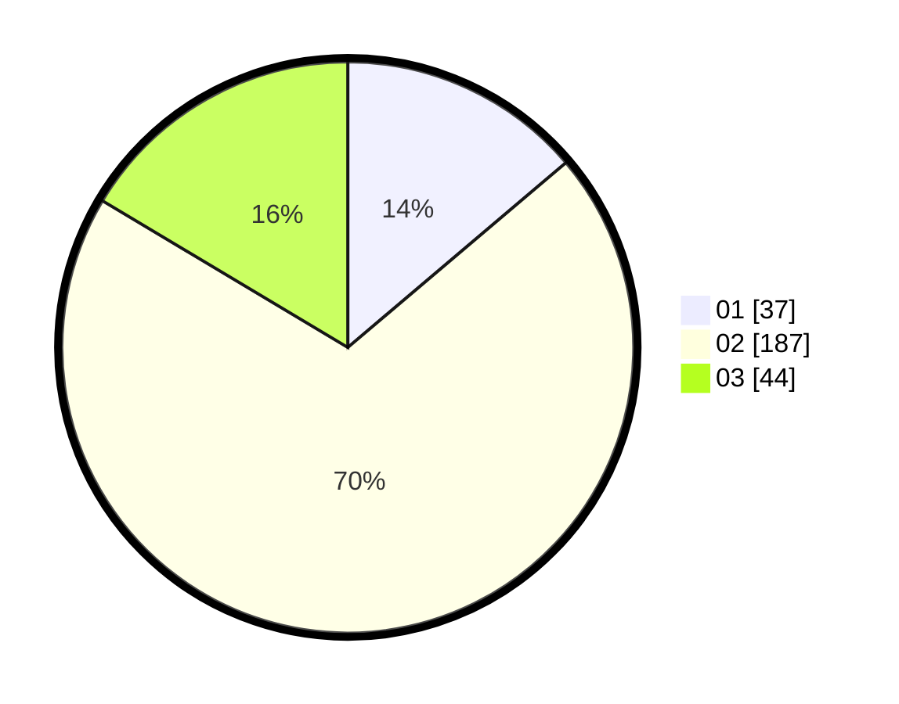

# Hasil

Hasil perolehan suara paslon dapat dilihat pada file paslon-01.txt, paslon-02.txt, dan paslon-03.txt.

Jika tidak ada, artinya data tersebut belum ada pada SIREKAP.

## Perolehan Suara

 * Paslon 01: **37**.
 * Paslon 02: **187**.
 * Paslon 03: **44**.

## Foto C Plano

https://sirekap-obj-formc.kpu.go.id/e7e7/pemilu/ppwp/31/75/03/10/08/3175031008913-20240214-214505--8c0a5e3c-be02-473a-bdd8-d6f033d2e006.jpg

https://sirekap-obj-formc.kpu.go.id/e7e7/pemilu/ppwp/31/75/03/10/08/3175031008913-20240214-214602--9fd316e0-e84a-4e7f-84c1-7890b89e2741.jpg

https://sirekap-obj-formc.kpu.go.id/e7e7/pemilu/ppwp/31/75/03/10/08/3175031008913-20240214-214637--3309cadc-f66d-414c-ade0-4c4647b3a231.jpg
