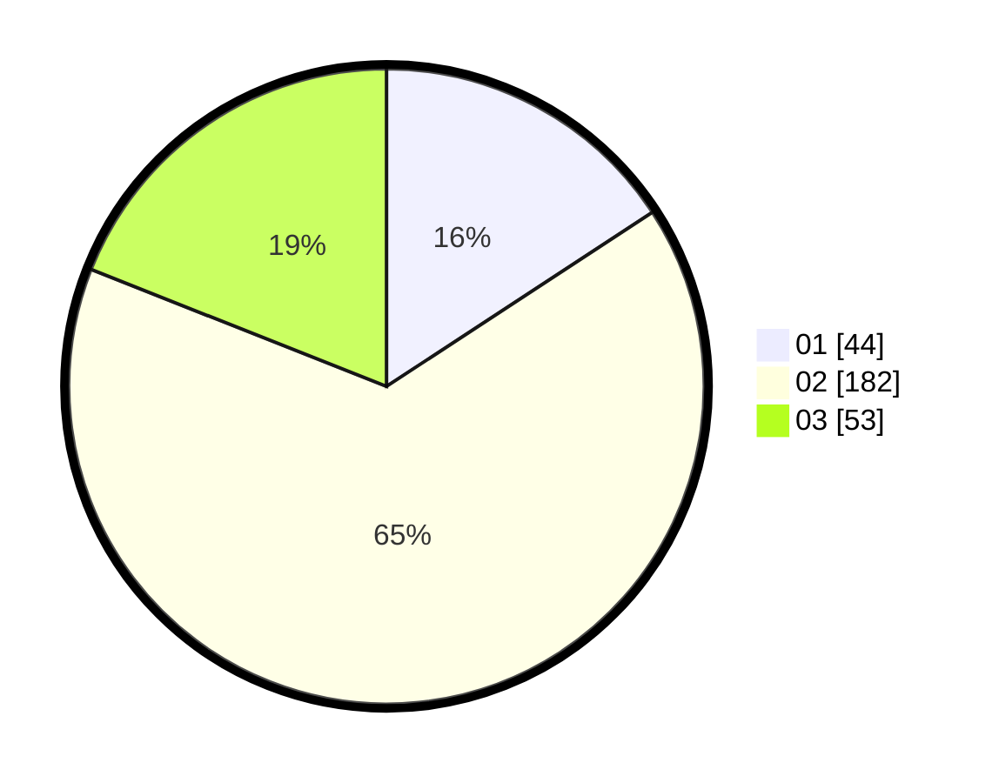

# Hasil

Hasil perolehan suara paslon dapat dilihat pada file paslon-01.txt, paslon-02.txt, dan paslon-03.txt.

Jika tidak ada, artinya data tersebut belum ada pada SIREKAP.

## Perolehan Suara

 * Paslon 01: **44**.
 * Paslon 02: **182**.
 * Paslon 03: **53**.

## Foto C Plano

https://sirekap-obj-formc.kpu.go.id/cb66/pemilu/ppwp/31/75/03/10/08/3175031008915-20240214-184752--79770184-45f6-4700-8085-0db8450cae99.jpg

https://sirekap-obj-formc.kpu.go.id/cb66/pemilu/ppwp/31/75/03/10/08/3175031008915-20240214-214646--ec367eca-6a85-4c77-bb17-4e837bce6abe.jpg

https://sirekap-obj-formc.kpu.go.id/cb66/pemilu/ppwp/31/75/03/10/08/3175031008915-20240214-214740--f46e33fb-15fc-4537-9b9b-2def464b62a4.jpg

## DATA PEMILIH TETAP

Jumlah pemilih dalam DPT: **284**.
 * L: **284**.
 * P: **0**.

## DATA PENGGUNA HAK PILIH

Jumlah pengguna hak pilih dalam DPT: **280**.
 * L: **280**.
 * P: **0**.

Jumlah pengguna hak pilih dalam DPTb: **9**.
 * L: **9**.
 * P: **0**.

Jumlah pengguna hak pilih dalam DPK: **0**.
 * L: **0**.
 * P: **0**.

Jumlah pengguna hak pilih: **289**.
 * L: **289**.
 * P: **0**.

## JUMLAH SUARA SAH DAN TIDAK SAH

JUMLAH SELURUH SUARA SAH: **279**.

JUMLAH SUARA TIDAK SAH: **10**.

JUMLAH SELURUH SUARA SAH DAN SUARA TIDAK SAH: **289**.
