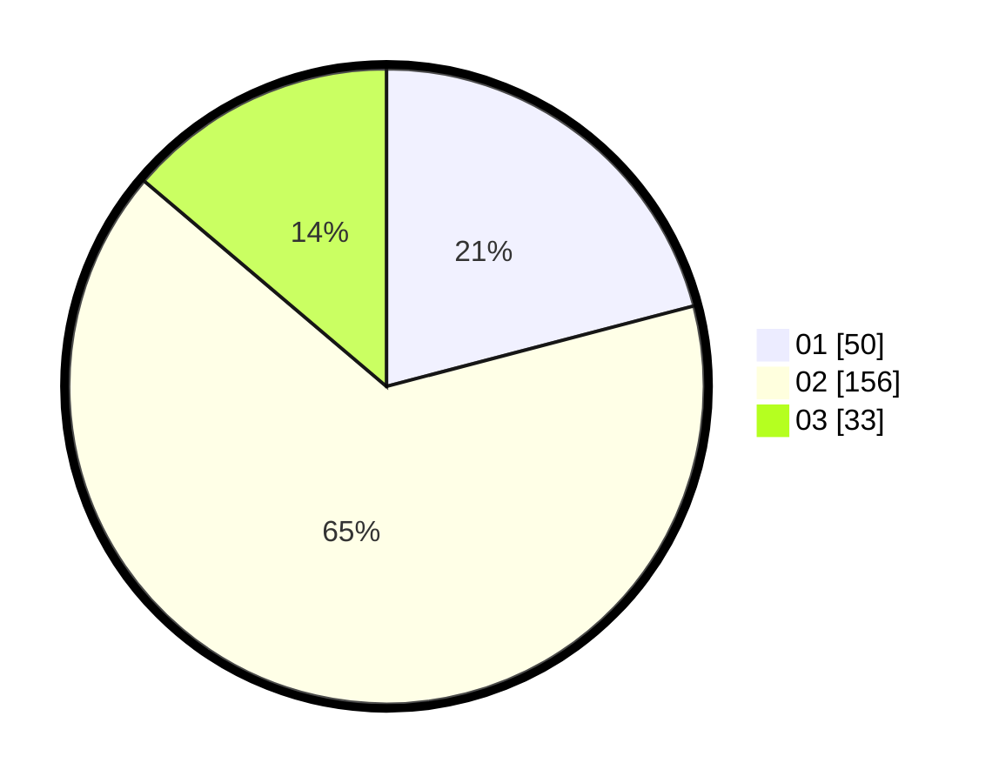

# Hasil

Hasil perolehan suara paslon dapat dilihat pada file paslon-01.txt, paslon-02.txt, dan paslon-03.txt.

Jika tidak ada, artinya data tersebut belum ada pada SIREKAP.

## Perolehan Suara

 * Paslon 01: **50**.
 * Paslon 02: **156**.
 * Paslon 03: **33**.

## Foto C Plano

https://sirekap-obj-formc.kpu.go.id/f43f/pemilu/ppwp/31/75/03/10/08/3175031008917-20240214-192141--5fa9040d-e1d4-463e-b66a-2fbaa64c1d75.jpg

https://sirekap-obj-formc.kpu.go.id/f43f/pemilu/ppwp/31/75/03/10/08/3175031008917-20240214-192318--b9878edd-d422-4c8d-9802-8146bec228be.jpg

https://sirekap-obj-formc.kpu.go.id/f43f/pemilu/ppwp/31/75/03/10/08/3175031008917-20240214-192531--63390be6-b29a-410c-b50d-5f520dfa4669.jpg

## DATA PEMILIH TETAP

Jumlah pemilih dalam DPT: **286**.
 * L: **286**.
 * P: **0**.

## DATA PENGGUNA HAK PILIH

Jumlah pengguna hak pilih dalam DPT: **122**.
 * L: **122**.
 * P: **0**.

Jumlah pengguna hak pilih dalam DPTb: **123**.
 * L: **120**.
 * P: **3**.

Jumlah pengguna hak pilih dalam DPK: **0**.
 * L: **0**.
 * P: **0**.

Jumlah pengguna hak pilih: **245**.
 * L: **242**.
 * P: **3**.

## JUMLAH SUARA SAH DAN TIDAK SAH

JUMLAH SELURUH SUARA SAH: **239**.

JUMLAH SUARA TIDAK SAH: **5**.

JUMLAH SELURUH SUARA SAH DAN SUARA TIDAK SAH: **244**.
