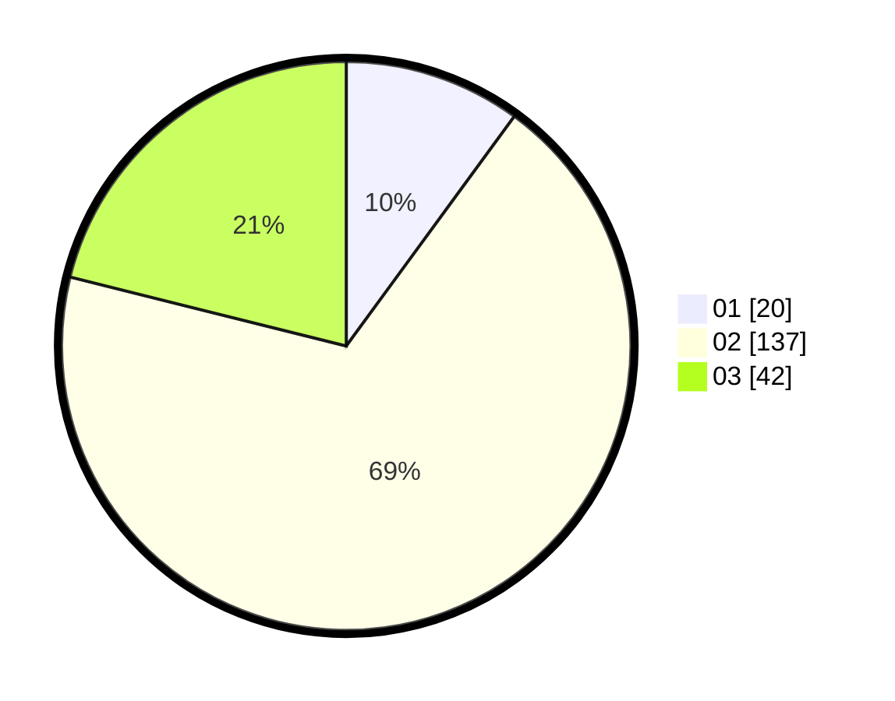

# Hasil

Hasil perolehan suara paslon dapat dilihat pada file paslon-01.txt, paslon-02.txt, dan paslon-03.txt.

Jika tidak ada, artinya data tersebut belum ada pada SIREKAP.

## Perolehan Suara

 * Paslon 01: **20**.
 * Paslon 02: **137**.
 * Paslon 03: **42**.

## Foto C Plano

https://sirekap-obj-formc.kpu.go.id/3261/pemilu/ppwp/31/75/03/10/08/3175031008923-20240214-203621--68b8b9cb-9aea-420f-8043-9c278b8441f9.jpg

https://sirekap-obj-formc.kpu.go.id/3261/pemilu/ppwp/31/75/03/10/08/3175031008923-20240214-214324--c998aeb9-10a3-466b-aaeb-ada4d4f9c95b.jpg

https://sirekap-obj-formc.kpu.go.id/3261/pemilu/ppwp/31/75/03/10/08/3175031008923-20240214-203726--8accb9ed-10cb-44ed-9a0b-749f26270f51.jpg

## DATA PEMILIH TETAP

Jumlah pemilih dalam DPT: **278**.
 * L: **278**.
 * P: **0**.

## DATA PENGGUNA HAK PILIH

Jumlah pengguna hak pilih dalam DPT: **177**.
 * L: **177**.
 * P: **0**.

Jumlah pengguna hak pilih dalam DPTb: **0**.
 * L: **0**.
 * P: **0**.

Jumlah pengguna hak pilih dalam DPK: **28**.
 * L: **28**.
 * P: **0**.

Jumlah pengguna hak pilih: **205**.
 * L: **205**.
 * P: **0**.

## JUMLAH SUARA SAH DAN TIDAK SAH

JUMLAH SELURUH SUARA SAH: **199**.

JUMLAH SUARA TIDAK SAH: **6**.

JUMLAH SELURUH SUARA SAH DAN SUARA TIDAK SAH: **205**.
