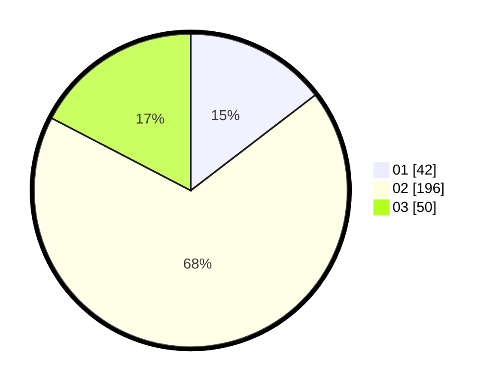

# Hasil

Hasil perolehan suara paslon dapat dilihat pada file paslon-01.txt, paslon-02.txt, dan paslon-03.txt.

Jika tidak ada, artinya data tersebut belum ada pada SIREKAP.

## Perolehan Suara

 * Paslon 01: **42**.
 * Paslon 02: **196**.
 * Paslon 03: **50**.

## Foto C Plano

https://sirekap-obj-formc.kpu.go.id/4048/pemilu/ppwp/31/75/03/10/08/3175031008924-20240215-164055--0ee33028-455e-4dd1-abfd-d1834dc918f5.jpg

https://sirekap-obj-formc.kpu.go.id/4048/pemilu/ppwp/31/75/03/10/08/3175031008924-20240215-164116--e1092029-6179-49dc-a16e-e54cc90c990a.jpg

https://sirekap-obj-formc.kpu.go.id/4048/pemilu/ppwp/31/75/03/10/08/3175031008924-20240215-164106--515adde1-1973-49b6-bbac-4b1d41f907c3.jpg

## DATA PEMILIH TETAP

Jumlah pemilih dalam DPT: **0**.
 * L: **0**.
 * P: **0**.

## DATA PENGGUNA HAK PILIH

Jumlah pengguna hak pilih dalam DPT: **64**.
 * L: **64**.
 * P: **0**.

Jumlah pengguna hak pilih dalam DPTb: **227**.
 * L: **227**.
 * P: **0**.

Jumlah pengguna hak pilih dalam DPK: **0**.
 * L: **0**.
 * P: **0**.

Jumlah pengguna hak pilih: **291**.
 * L: **291**.
 * P: **0**.

## JUMLAH SUARA SAH DAN TIDAK SAH

JUMLAH SELURUH SUARA SAH: **288**.

JUMLAH SUARA TIDAK SAH: **3**.

JUMLAH SELURUH SUARA SAH DAN SUARA TIDAK SAH: **291**.
