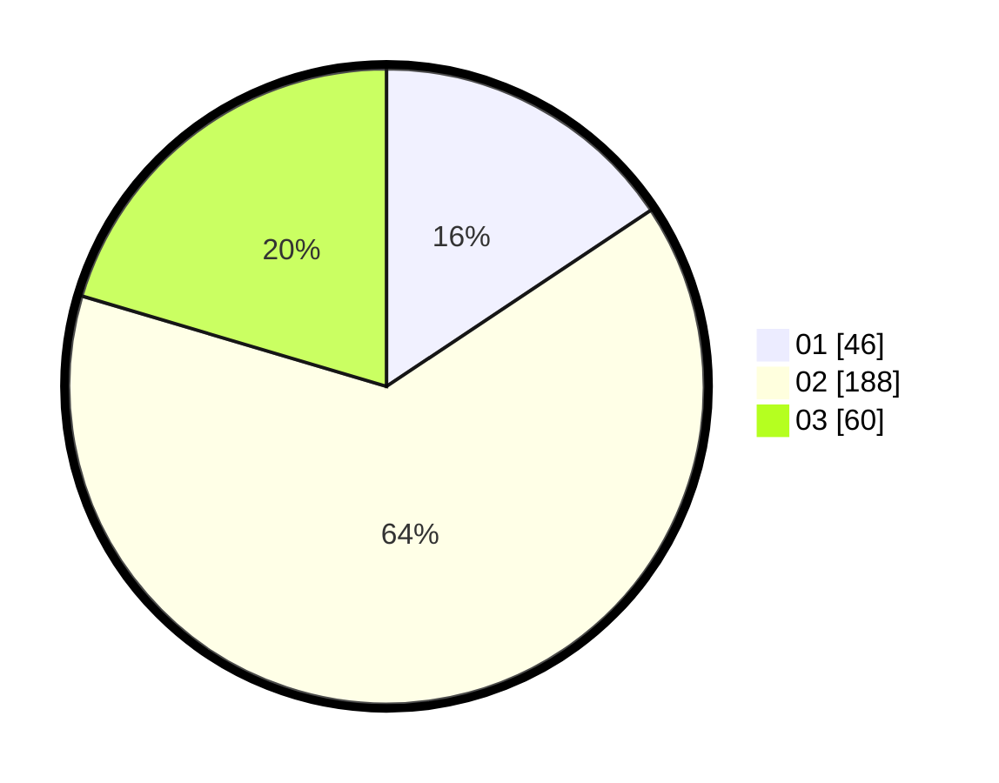

# Hasil

Hasil perolehan suara paslon dapat dilihat pada file paslon-01.txt, paslon-02.txt, dan paslon-03.txt.

Jika tidak ada, artinya data tersebut belum ada pada SIREKAP.

## Perolehan Suara

 * Paslon 01: **46**.
 * Paslon 02: **188**.
 * Paslon 03: **60**.

## Foto C Plano

https://sirekap-obj-formc.kpu.go.id/befb/pemilu/ppwp/31/75/03/10/08/3175031008928-20240219-130506--63ffdc8f-ae20-40e0-802f-cd3bc9fc1866.jpg

https://sirekap-obj-formc.kpu.go.id/befb/pemilu/ppwp/31/75/03/10/08/3175031008928-20240219-130507--d62ebd6d-187a-4d7a-954b-91564bab49aa.jpg

https://sirekap-obj-formc.kpu.go.id/befb/pemilu/ppwp/31/75/03/10/08/3175031008928-20240219-130506--9e349033-5220-4f61-9346-c755ef1479bd.jpg

## DATA PEMILIH TETAP

Jumlah pemilih dalam DPT: **158**.
 * L: **156**.
 * P: **2**.

## DATA PENGGUNA HAK PILIH

Jumlah pengguna hak pilih dalam DPT: **158**.
 * L: **156**.
 * P: **2**.

Jumlah pengguna hak pilih dalam DPTb: **142**.
 * L: **142**.
 * P: **0**.

Jumlah pengguna hak pilih dalam DPK: **0**.
 * L: **0**.
 * P: **0**.

Jumlah pengguna hak pilih: **300**.
 * L: **298**.
 * P: **2**.

## JUMLAH SUARA SAH DAN TIDAK SAH

JUMLAH SELURUH SUARA SAH: **294**.

JUMLAH SUARA TIDAK SAH: **6**.

JUMLAH SELURUH SUARA SAH DAN SUARA TIDAK SAH: **300**.
