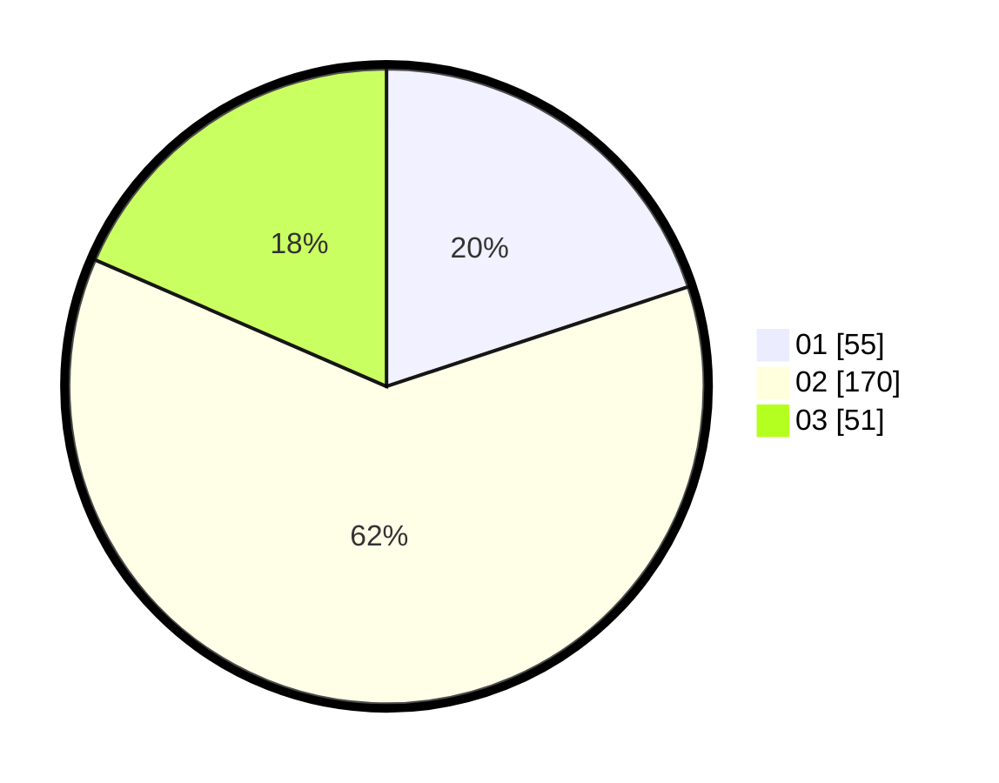

# Hasil

Hasil perolehan suara paslon dapat dilihat pada file paslon-01.txt, paslon-02.txt, dan paslon-03.txt.

Jika tidak ada, artinya data tersebut belum ada pada SIREKAP.

## Perolehan Suara

 * Paslon 01: **55**.
 * Paslon 02: **170**.
 * Paslon 03: **51**.

## Foto C Plano

https://sirekap-obj-formc.kpu.go.id/f265/pemilu/ppwp/31/75/03/10/08/3175031008929-20240216-141113--0ae20304-13ba-4ddf-944d-5fe005c83a7c.jpg

https://sirekap-obj-formc.kpu.go.id/f265/pemilu/ppwp/31/75/03/10/08/3175031008929-20240216-141114--99089637-ecc3-40bd-9b77-ed90a4b8c33a.jpg

https://sirekap-obj-formc.kpu.go.id/f265/pemilu/ppwp/31/75/03/10/08/3175031008929-20240216-141114--1ef86d93-48fd-441a-9a5c-16c2262da5c3.jpg

## DATA PEMILIH TETAP

Jumlah pemilih dalam DPT: **275**.
 * L: **275**.
 * P: **0**.

## DATA PENGGUNA HAK PILIH

Jumlah pengguna hak pilih dalam DPT: **64**.
 * L: **64**.
 * P: **0**.

Jumlah pengguna hak pilih dalam DPTb: **217**.
 * L: **214**.
 * P: **3**.

Jumlah pengguna hak pilih dalam DPK: **0**.
 * L: **0**.
 * P: **0**.

Jumlah pengguna hak pilih: **281**.
 * L: **278**.
 * P: **3**.

## JUMLAH SUARA SAH DAN TIDAK SAH

JUMLAH SELURUH SUARA SAH: **276**.

JUMLAH SUARA TIDAK SAH: **5**.

JUMLAH SELURUH SUARA SAH DAN SUARA TIDAK SAH: **281**.
