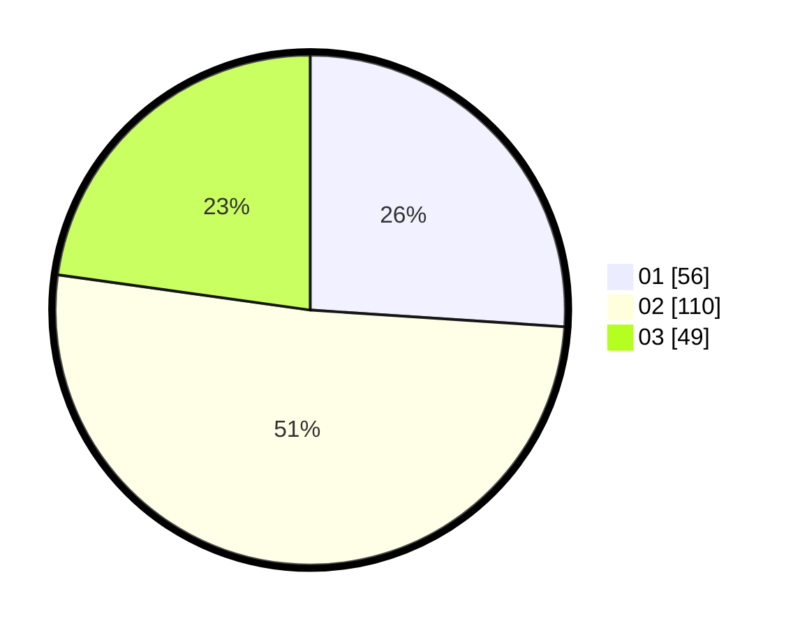

# Hasil

Hasil perolehan suara paslon dapat dilihat pada file paslon-01.txt, paslon-02.txt, dan paslon-03.txt.

Jika tidak ada, artinya data tersebut belum ada pada SIREKAP.

## Perolehan Suara

 * Paslon 01: **56**.
 * Paslon 02: **110**.
 * Paslon 03: **49**.

## Foto C Plano

https://sirekap-obj-formc.kpu.go.id/a7ca/pemilu/ppwp/31/75/04/10/01/3175041001004-20240214-155322--4d91744f-9a11-4cd6-baed-b1131c49ddbb.jpg

https://sirekap-obj-formc.kpu.go.id/a7ca/pemilu/ppwp/31/75/04/10/01/3175041001004-20240214-155543--e75a556d-d09f-4cf0-b3ff-f89cb4b85399.jpg

https://sirekap-obj-formc.kpu.go.id/a7ca/pemilu/ppwp/31/75/04/10/01/3175041001004-20240214-155713--0764101e-fe27-4083-a8b3-5ff66c1299a6.jpg

## DATA PEMILIH TETAP

Jumlah pemilih dalam DPT: **277**.
 * L: **134**.
 * P: **143**.

## DATA PENGGUNA HAK PILIH

Jumlah pengguna hak pilih dalam DPT: **277**.
 * L: **134**.
 * P: **143**.

Jumlah pengguna hak pilih dalam DPTb: **0**.
 * L: **0**.
 * P: **0**.

Jumlah pengguna hak pilih dalam DPK: **2**.
 * L: **1**.
 * P: **1**.

Jumlah pengguna hak pilih: **279**.
 * L: **135**.
 * P: **144**.

## JUMLAH SUARA SAH DAN TIDAK SAH

JUMLAH SELURUH SUARA SAH: **215**.

JUMLAH SUARA TIDAK SAH: **3**.

JUMLAH SELURUH SUARA SAH DAN SUARA TIDAK SAH: **218**.
