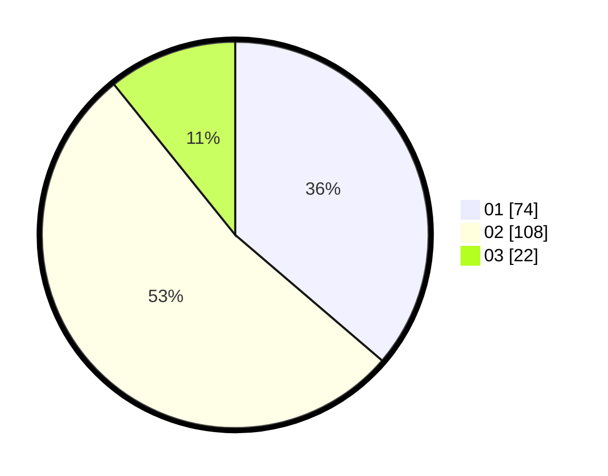

# Hasil

Hasil perolehan suara paslon dapat dilihat pada file paslon-01.txt, paslon-02.txt, dan paslon-03.txt.

Jika tidak ada, artinya data tersebut belum ada pada SIREKAP.

## Perolehan Suara

 * Paslon 01: **74**.
 * Paslon 02: **108**.
 * Paslon 03: **22**.

## Foto C Plano

https://sirekap-obj-formc.kpu.go.id/0cfc/pemilu/ppwp/31/75/04/10/01/3175041001015-20240217-201620--57a0c770-e738-493d-9a58-5575d4efea19.jpg

https://sirekap-obj-formc.kpu.go.id/0cfc/pemilu/ppwp/31/75/04/10/01/3175041001015-20240217-201841--eb3d917d-ee50-4f3a-b9f7-e2f05f517bfe.jpg

https://sirekap-obj-formc.kpu.go.id/0cfc/pemilu/ppwp/31/75/04/10/01/3175041001015-20240217-202032--ee166d60-6614-4101-b8a0-729b4fb02ade.jpg

## DATA PEMILIH TETAP

Jumlah pemilih dalam DPT: **265**.
 * L: **124**.
 * P: **141**.

## DATA PENGGUNA HAK PILIH

Jumlah pengguna hak pilih dalam DPT: **203**.
 * L: **92**.
 * P: **111**.

Jumlah pengguna hak pilih dalam DPTb: **0**.
 * L: **0**.
 * P: **0**.

Jumlah pengguna hak pilih dalam DPK: **2**.
 * L: **1**.
 * P: **1**.

Jumlah pengguna hak pilih: **205**.
 * L: **93**.
 * P: **112**.

## JUMLAH SUARA SAH DAN TIDAK SAH

JUMLAH SELURUH SUARA SAH: **204**.

JUMLAH SUARA TIDAK SAH: **1**.

JUMLAH SELURUH SUARA SAH DAN SUARA TIDAK SAH: **205**.
