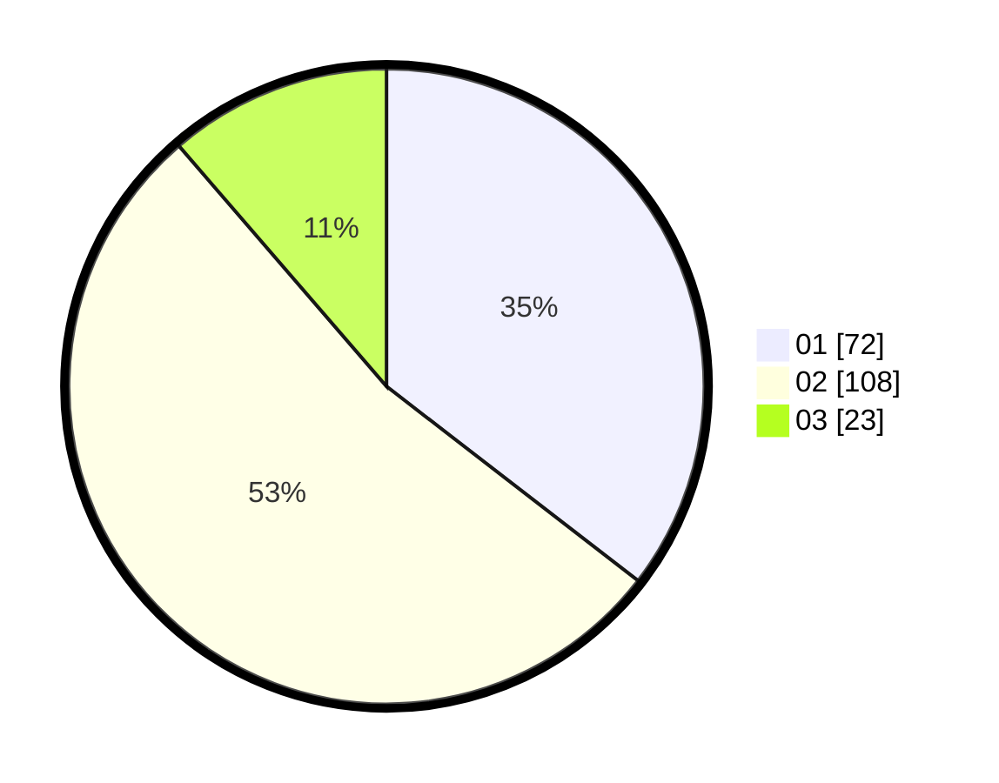

# Hasil

Hasil perolehan suara paslon dapat dilihat pada file paslon-01.txt, paslon-02.txt, dan paslon-03.txt.

Jika tidak ada, artinya data tersebut belum ada pada SIREKAP.

## Perolehan Suara

 * Paslon 01: **72**.
 * Paslon 02: **108**.
 * Paslon 03: **23**.

## Foto C Plano

https://sirekap-obj-formc.kpu.go.id/6cb5/pemilu/ppwp/31/75/04/10/01/3175041001018-20240215-005053--9207515f-4eff-4918-a2f8-006ec0fa70a7.jpg

https://sirekap-obj-formc.kpu.go.id/6cb5/pemilu/ppwp/31/75/04/10/01/3175041001018-20240215-005212--69a1d0cd-f90e-45f1-aae0-b006a150297f.jpg

https://sirekap-obj-formc.kpu.go.id/6cb5/pemilu/ppwp/31/75/04/10/01/3175041001018-20240215-005318--1f90728b-1314-49c6-8217-39f2d7ef06ee.jpg

## DATA PEMILIH TETAP

Jumlah pemilih dalam DPT: **278**.
 * L: **126**.
 * P: **152**.

## DATA PENGGUNA HAK PILIH

Jumlah pengguna hak pilih dalam DPT: **202**.
 * L: **84**.
 * P: **118**.

Jumlah pengguna hak pilih dalam DPTb: **0**.
 * L: **0**.
 * P: **0**.

Jumlah pengguna hak pilih dalam DPK: **2**.
 * L: **2**.
 * P: **0**.

Jumlah pengguna hak pilih: **204**.
 * L: **86**.
 * P: **118**.

## JUMLAH SUARA SAH DAN TIDAK SAH

JUMLAH SELURUH SUARA SAH: **203**.

JUMLAH SUARA TIDAK SAH: **1**.

JUMLAH SELURUH SUARA SAH DAN SUARA TIDAK SAH: **204**.
