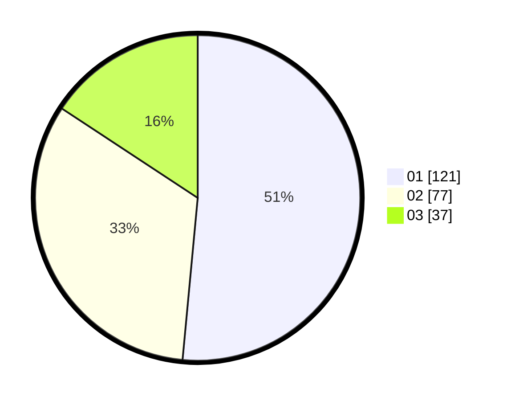

# Hasil

Hasil perolehan suara paslon dapat dilihat pada file paslon-01.txt, paslon-02.txt, dan paslon-03.txt.

Jika tidak ada, artinya data tersebut belum ada pada SIREKAP.

## Perolehan Suara

 * Paslon 01: **121**.
 * Paslon 02: **77**.
 * Paslon 03: **37**.

## Foto C Plano

https://sirekap-obj-formc.kpu.go.id/692e/pemilu/ppwp/31/75/04/10/01/3175041001025-20240217-121945--813f147b-fde4-43fb-a95f-fc487335eb8c.jpg

https://sirekap-obj-formc.kpu.go.id/692e/pemilu/ppwp/31/75/04/10/01/3175041001025-20240217-124706--f93cb522-f4a0-456c-bfca-71fd2458da6b.jpg

https://sirekap-obj-formc.kpu.go.id/692e/pemilu/ppwp/31/75/04/10/01/3175041001025-20240217-124429--ccabfbe0-ce67-4a1e-973b-fe0529707a94.jpg

## DATA PEMILIH TETAP

Jumlah pemilih dalam DPT: **290**.
 * L: **142**.
 * P: **148**.

## DATA PENGGUNA HAK PILIH

Jumlah pengguna hak pilih dalam DPT: **239**.
 * L: **112**.
 * P: **127**.

Jumlah pengguna hak pilih dalam DPTb: **0**.
 * L: **0**.
 * P: **0**.

Jumlah pengguna hak pilih dalam DPK: **1**.
 * L: **0**.
 * P: **1**.

Jumlah pengguna hak pilih: **240**.
 * L: **112**.
 * P: **128**.

## JUMLAH SUARA SAH DAN TIDAK SAH

JUMLAH SELURUH SUARA SAH: **235**.

JUMLAH SUARA TIDAK SAH: **5**.

JUMLAH SELURUH SUARA SAH DAN SUARA TIDAK SAH: **240**.
