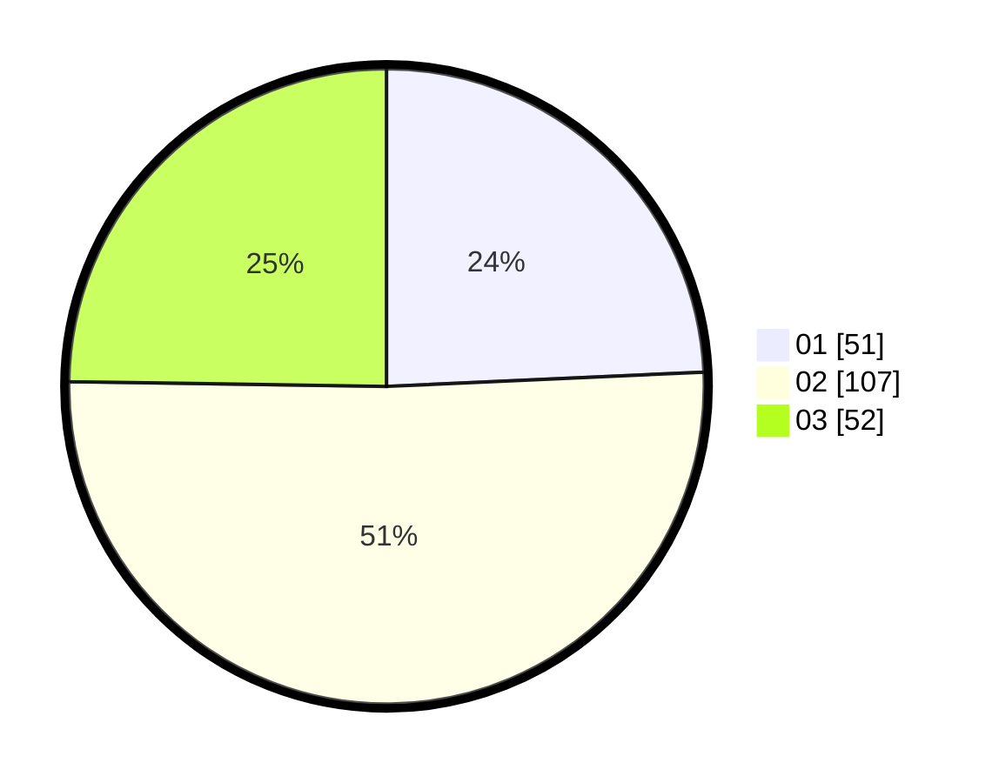

# Hasil

Hasil perolehan suara paslon dapat dilihat pada file paslon-01.txt, paslon-02.txt, dan paslon-03.txt.

Jika tidak ada, artinya data tersebut belum ada pada SIREKAP.

## Perolehan Suara

 * Paslon 01: **51**.
 * Paslon 02: **107**.
 * Paslon 03: **52**.

## Foto C Plano

https://sirekap-obj-formc.kpu.go.id/2218/pemilu/ppwp/31/75/04/10/01/3175041001028-20240218-114309--02bbaf2e-4adf-4fd6-838f-69a89f314622.jpg

https://sirekap-obj-formc.kpu.go.id/2218/pemilu/ppwp/31/75/04/10/01/3175041001028-20240218-115418--efabd6ec-4d3a-45eb-ad76-d4e75f217c57.jpg

https://sirekap-obj-formc.kpu.go.id/2218/pemilu/ppwp/31/75/04/10/01/3175041001028-20240218-115747--fb10f527-b0ad-4765-bb56-f3026f8bd3df.jpg
